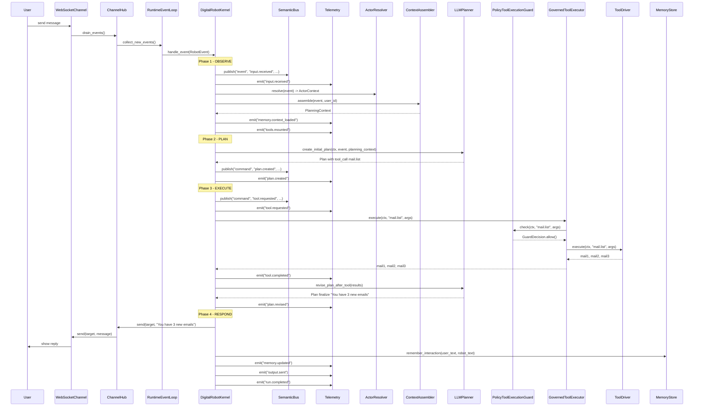
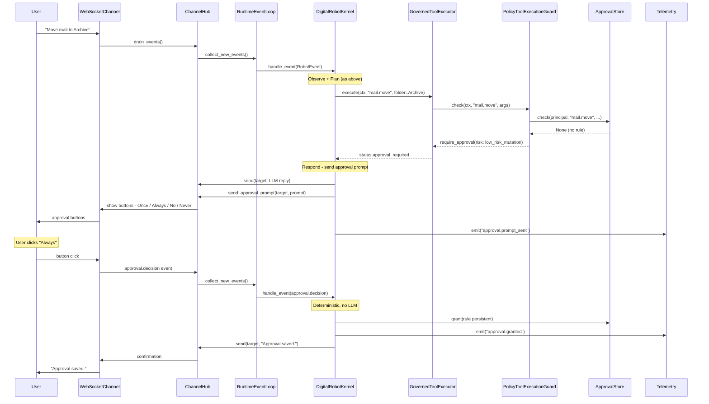

# Diagrams

Three views of the cephix harness:

1. **Component diagram** — all building blocks, grouped by layer.
2. **Sequence — RobotEvent flow** — a single event from arrival to audit.
3. **Sequence — approval flow** — what happens when a tool is blocked
   and the user is asked.

Click any diagram to zoom and pan (Alt + scroll wheel).

## 1. Component diagram — all building blocks

```mermaid
graph TB
  subgraph Entrypoints ["Entrypoints"]
    CLI["CLI<br/>src/cli.py"]
    Main["__main__.py"]
    Script["cephix-drp.py"]
  end

  subgraph Wiring ["Composition Root"]
    App["app.py<br/>build_websocket_service<br/>build_demo_robot"]
  end

  subgraph RuntimeLayer ["Runtime layer"]
    Robot["DigitalRobot<br/>src/robot.py"]
    EventLoop["RuntimeEventLoop<br/>src/runtime/event_loop.py"]
    Kernel["DigitalRobotKernel<br/>src/runtime/kernel.py"]
    Service["RobotService<br/>src/service.py"]
    ControlPlane["RobotControlPlane<br/>src/control.py"]
  end

  subgraph GatewayLayer ["Channels / Gateways"]
    Hub["ChannelHub<br/>src/gateways/hub.py"]
    WS["WebSocketChannel"]
    TG["TelegramChannel"]
    WA["WhatsAppChannel"]
  end

  subgraph ContextLayer ["Context layer"]
    Assembler["DefaultContextAssembler<br/>src/context.py"]
    FW["MarkdownFirmwareStore"]
    MemDocs["MarkdownMemoryDocumentStore"]
    SOPResolver["DefaultSOPResolver<br/>src/sop/resolver.py"]
    SkillResolver["SkillResolverPort"]
    NotebookStore["FileNotebookStore<br/>src/notebooks/store.py"]
  end

  subgraph PlannerLayer ["Planner layer"]
    LLMPlanner["LLMPlanner<br/>src/planners/llm.py"]
    KeywordPlanner["KeywordPlanner<br/>src/planners/keyword.py"]
  end

  subgraph ToolLayer ["Tool layer"]
    Executor["GovernedToolExecutor<br/>src/tools/executor.py"]
    Collector["ToolCollector<br/>src/tools/collector.py"]
    SystemTools["SystemToolDriver<br/>memory.* notebook.* task.*"]
    MailTools["MailToolDriver<br/>IMAP + MCS"]
    SOPTools["SOPToolDriver"]
    WorkstationTools["WorkstationToolDriver<br/>Docker"]
  end

  subgraph GovernanceLayer ["Governance layer"]
    Guard["PolicyToolExecutionGuard<br/>src/governance/tool_guard.py"]
    RiskClassifier["MetadataRiskClassifier"]
    ApprovalStore["FileApprovalStore<br/>JSONL"]
    ActorResolver["ConfigBasedActorResolver"]
    InputGuard["InputGuardPort<br/>not wired"]
    OutputGuard["OutputGuardPort<br/>not wired"]
  end

  subgraph AuditLayer ["Audit layer"]
    Telemetry["Telemetry<br/>src/telemetry.py"]
    EventLog["EventLog<br/>JSONL"]
    LogSink["LoggingEventSink"]
    Fanout["FanoutEventSink"]
    Bus["SemanticBus<br/>src/bus.py"]
  end

  subgraph KnowledgeLayer ["Knowledge layer"]
    Memory["PersistentMemoryStore<br/>src/memory/persistent.py"]
    FirmwareFiles["robot/firmware/<br/>AGENTS.md POLICY.md<br/>CONSTITUTION.md"]
    MemoryFiles["robot/memory/<br/>IDENTITY.md USER.md<br/>MEMORY.md BOOTSTRAP.md"]
    SOPFiles["SOPDefinition<br/>YAML"]
  end

  subgraph DomainModels ["Domain models"]
    RobotEvent["RobotEvent"]
    PlanningContext["PlanningContext"]
    Plan["Plan + PlanStep"]
    GuardDecision["GuardDecision"]
    WideEvent["WideEvent"]
  end

  CLI --> App
  Main --> CLI
  Script --> App
  App --> Robot
  Robot --> Kernel
  Robot --> EventLoop
  Robot --> ControlPlane
  Service --> EventLoop

  Hub --> WS
  Hub --> TG
  Hub --> WA
  Hub -.->|EventSourcePort| EventLoop
  EventLoop -->|handle_event| Kernel

  Kernel -->|assemble| Assembler
  Assembler --> FW
  Assembler --> MemDocs
  Assembler -.->|optional| SOPResolver
  Assembler -.->|optional| SkillResolver
  Assembler --> NotebookStore
  FW --> FirmwareFiles
  MemDocs --> MemoryFiles
  SOPResolver --> SOPFiles

  Kernel -->|create_initial_plan| LLMPlanner
  Kernel -->|execute| Executor
  Executor -->|check| Guard
  Guard --> RiskClassifier
  Guard --> ApprovalStore
  Executor -->|execute| Collector
  Collector --> SystemTools
  Collector --> MailTools
  Collector --> SOPTools
  Collector --> WorkstationTools

  Kernel --> ActorResolver
  Kernel -->|send| Hub
  Kernel -->|emit| Telemetry
  Kernel -->|publish| Bus
  Kernel -->|remember_interaction| Memory
  Telemetry --> Fanout
  Fanout --> EventLog
  Fanout --> LogSink
```

## 2. Sequence diagram — RobotEvent flow with reply and BusPort

## 3. Sequence diagram — approval flow (tool is blocked)

