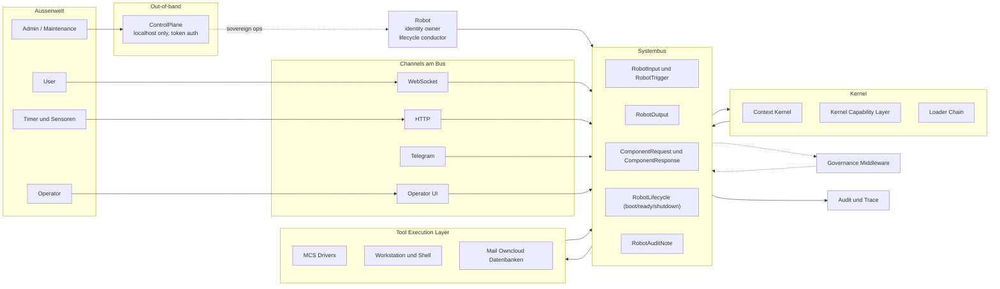

# Robot OS — Zielarchitektur

> Status: kanonisches Zielmodell. Der bisherige Code unter `_reference/` ist als
> Referenz erhalten und wird nicht mehr fortgeschrieben. `src/` enthaelt die
> schrittweise neu aufgebaute Implementierung dieses Zielmodells.

Cephix wird als bus-zentrische, prompt-programmierbare Robot-Plattform neu
aufgebaut. Karpathys LLM-OS-Idee und Software 3.0 liefern den Programmierbegriff:
Firmware, SOPs, Skills, Toolbeschreibungen und Memory sind nicht Beiwerk, sondern
die Software, die in einen handlungsfaehigen Kontext geladen wird. ROS und PC
liefern die Strukturanalogie: ein Systembus als tragendes Organ, an dem
Kernel, IO-Kanaele, Tool Execution, Loader, Governance und Audit als
Teilnehmer haengen.

## Leitidee

Der Systembus ist nicht eine Komponente neben anderen, sondern das tragende
Organ. Alles, was der Roboter wahrnimmt, entscheidet, ausfuehrt oder
protokolliert, ist eine Nachricht auf diesem Bus. Komponenten existieren als
Teilnehmer am Bus, nicht als zueinander verdrahtete Dienste. Was nicht auf
dem Bus stattfindet, existiert in der Architektur nicht.

Damit verschwinden die heutigen Doppelstrukturen aus `SemanticBus`,
`RuntimeEventLoop.queue` und `Telemetry`. Es gibt einen Bus, einen Vertrag,
viele Teilnehmer.

Eine Roboterinstanz ist genau ein Bus. Multi-Roboter ist Federation ueber
mehrere Busse, nicht ein gemeinsamer Bus.

## Topologie



Lese-Reihenfolge: alle Pfeile gegen den Bus, mit *einer* Ausnahme.
Governance sitzt als Pre-Delivery-Middleware *im* Bus, nicht daneben.
Audit haengt als Subscriber dran. Die Ausnahme ist die `ControlPlane`:
sie sitzt parallel zum Bus, nicht auf ihm, und spricht direkt mit
dem `Robot`. Genau diese Out-of-band-Position ist der Grund, warum
Operator-Zugriff und Identitaetsfuehrung auch dann funktionieren,
wenn der Bus ausfaellt.

## Bus-Semantik

Der Bus ist eine routende Queue-Infrastruktur, nicht ein Broadcast-Strom.
Jeder Teilnehmer hat seine eigene Queue, der Bus routet Nachrichten anhand
von Topic, Adressat oder Korrelation in die richtige Queue. Teilnehmer
pullen, wenn sie bereit sind.

Der Bus selbst wird als Port modelliert. Erste Implementierung in-memory mit
`asyncio.Queue`. Der Port deklariert aber bereits die Eigenschaften, die
persistente Bus-Implementierungen mitbringen (gerichtetes Routing, Topics,
Subscribe, Ack, Dead Letter, Korrelation, Priority, Timeout). Der Wechsel
zu einer persistenten Implementierung ist dann ein Adapter-Tausch.

Eigenschaften:

- **Backpressure**: ein langsamer Teilnehmer bremst nur seine eigene Queue.
- **Crash-Resilienz**: Queues koennen persistent sein. Was nicht abgeholt
  wurde, ueberlebt einen Neustart.
- **Reihenfolge**: FIFO pro Queue, bewusst keine globale Ordnung.
- **Priority pro Queue**: Antworten duerfen vor neuen Inputs eingereiht
  werden, damit ein laufender Run nicht hinter neuer Konversation wartet.
- **Timeouts und Dead Letter**: eine `ComponentRequest` deklariert ihre maximale
  Antwortzeit; bei Ueberschreitung erzeugt der Bus eine
  Fehler-`ComponentResponse`. Nicht zustellbare Nachrichten landen in einer
  Dead-Letter-Queue.

Pub/Sub ist die Ausnahme, nicht die Regel. Broadcast wird gezielt fuer
zwei Genres genutzt:

- **Lifecycle**: `RobotLifecycle` auf `robot.lifecycle`. Eine Klasse,
  drei Phasen (`boot`, `ready`, `shutdown`) als Discriminator-Feld.
  Alle drei mit *retain* gepublished, damit spaete Subscriber (auch
  nachtraeglich angeklemmte Audit-Sinks oder Operator-Tools) den
  jeweils letzten Stand sofort als ersten Event in ihre Queue gelegt
  bekommen. Es wird nur **ein** Slot pro Topic gehalten — ein neuer
  Event ersetzt den alten. Damit ein `phase="ready"`-Event einen
  verspaeteten Subscriber so vollstaendig informieren kann wie
  `phase="boot"` es getan haette, traegt jeder boot/ready-Event
  denselben Komponenten-Manifest mit.
- **Audit**: `RobotAuditNote` auf `robot.audit.note` als gerichtete
  Queue (kein Broadcast, kein retain). Komponenten publishen Audit-
  Notes ueber den `RobotComponent.publish_audit()`-Helper, der
  Audit-Sink konsumiert sie ueber eine normale `subscribe`. Die
  Trennung von Telemetrie ist absichtlich: Audit ist die kuratierte
  Verantwortungsspur ("dies hat der Roboter bewusst getan"),
  Telemetrie ist die rohe Bus-Spur ("das ist passiert").

Routable Queue (`subscribe`) und Broadcast (`subscribe_broadcast`)
leben in getrennten Buckets: ein `publish` erreicht keinen
Broadcast-Subscriber, ein `publish_broadcast` keinen Routable-Subscriber.

Querschnittsbeobachter (`subscribe_all`) bekommen *eine* Kopie pro
Event-Auslieferung -- egal ob `publish` oder `publish_broadcast`,
egal welches Topic. Read-only by design: der Handler kann eine
Auslieferung weder modifizieren noch verhindern. Topic-ACLs und
Governance-Pre-Delivery-Eingriffe sind ein separat zu designendes
Mechanismus-Paket und keine Erweiterung von `subscribe_all` (siehe
"Bewusst noch nicht entschieden").

Mapping pro Nachrichtentyp:

- `RobotInput` und `RobotTrigger`: Queue, Empfaenger Kernel.
- `ComponentRequest`: Queue, gerichtet an genau einen Adressaten (Tool-Driver,
  Loader, Content-Filter).
- `ComponentResponse`: Queue, ueber `correlation_id` zurueck an den Sender der
  `ComponentRequest`.
- `RobotOutput`: Queue, ueber Adressierung an den passenden Channel.
- `RobotLifecycle` (alle Phasen): Pub/Sub mit retain auf
  `robot.lifecycle`. Eine Quelle (der `Robot`), beliebig viele
  Subscriber. Phasen-Variation lebt im `phase`-Feld, nicht in
  Subklassen.
- `ComponentLifecycle`: Pub/Sub mit retain auf
  `component.<name>.lifecycle` — eigenes Topic pro Komponente,
  also ein Retain-Slot pro Komponente. Owner publiziert; aktuell
  Robot fuer direkte Kinder, Kernel fuer den In-Process-Actor.
- `MountEvent`: Pub/Sub *ohne* retain auf `component.<name>.mount`.
  Der "aktueller Mount-Stand"-Snapshot lebt in
  `ComponentInfo.metadata` auf dem retained `ComponentLifecycle`;
  `MountEvent` ist nur der Realtime-Stream der Transitionen.
- `RobotAuditNote`: Routable Queue auf `robot.audit.note`. Wird vom
  `AuditNoteSink` konsumiert (Komponente mit `category=AUDIT`).
  Telemetry-Recorder sieht die Note ebenfalls, aber als Teil seines
  rohen Bus-Stroms; das curated Audit-Log liegt am Topic.

## Bus-Vertrag

Alle Nachrichten sind `RobotEvent`. Subtypen druecken Rolle und
Erwartungshaltung aus:

- `RobotInput`: konversationale Eingabe von aussen. Beispiel: User schickt
  Text auf einem Channel. Das textuelle Nutzdatum liegt im Feld
  `message`, strukturierte Channel-Metadaten (Session-ID, Anhaenge,
  ...) im `payload`.
- `RobotTrigger`: autonome Anregung von aussen ohne Konversationsabsicht.
  Beispiel: Timer, Sensor, geplanter Job. Kann auch als Spezialfall von
  `RobotInput` modelliert werden, behaelt aber semantischen Eigenwert fuer
  Routing und Audit.
- `RobotOutput`: Nachricht an die Aussenwelt, fire-and-forget. Beispiel:
  Antworttext an User, Mailversand-Bestaetigung an Channel. Symmetrisch
  zu `RobotInput`: Nutztext im Feld `message`. Erbt von `Failable`, traegt
  also `status` und optional `error: ErrorInfo` (siehe
  "Result-Vokabular" weiter unten) — Channels rendern Fehler-Outputs
  als Fehler (Banner, Retry-Button) statt als gewoehnliche Antwort.
- `ComponentRequest`: gerichtete Anfrage zwischen Bus-Teilnehmern, erwartet
  Antwort. Beispiel: Kernel fragt Tool Execution Layer nach `mail.list`.
  Kernel fragt Channel nach Approval.
- `ComponentResponse`: Antwort auf eine `ComponentRequest`. Verweist per
  Korrelation auf die ausloesende Anfrage. Erbt von `Failable`: Erfolg
  (`status="ok"` plus `payload`) und Fehler (`status="error"` plus
  `error: ErrorInfo`) tragen dasselbe Vokabular wie der Rest des Bus.
- `RobotLifecycle`: einziger Lifecycle-Typ fuer den Roboter als
  Ganzes. Erbt vom `LifecycleAware`-Mixin, das die fuenf
  kanonischen Phasen `boot`, `ready`, `warn`, `failure`,
  `shutdown` durchsetzt:
  - `phase="boot"`: *frueh* in der Bootsequenz, sobald Identitaet
    und Komponenten-Inventar bekannt sind, aber bevor Kernel und
    Channels attachen. Traegt `robot_id`, `robot_name`, `robot_run_id`
    und einen Snapshot der gestarteten Komponenten. Wird retained
    gepublished, damit spaeter angeklemmte Komponenten den Stand
    kennen. Analogon: Kernel-dmesg.
  - `phase="ready"`: *spaet*, nachdem Kernel und alle Channels
    attached sind. Traegt dieselbe Identitaet und denselben
    Manifest-Snapshot, ueberschreibt den retained-Slot und
    signalisiert "Roboter ist im Vollbetrieb". Analogon:
    `multi-user.target reached` bei systemd.
  - `phase="warn"` / `phase="failure"`: optional, wenn der Robot
    eine seiner Komponenten ueber den Owner-Loop als degradiert
    bzw. ausgefallen meldet. Re-Publish mit aktualisiertem
    Manifest aktualisiert den retained Slot — kein separater
    `update`-Phase noetig.
  - `phase="shutdown"`: bei Beginn der Shutdown-Sequenz. Traegt
    optional `message` (Default `"Robot shutting down"`, vom
    Operator ueberschreibbar via `Robot.stop(message=...)`).
    `grace_seconds` ist *bewusst nicht* im Event — die Frist ist
    Supervisor-Policy auf dem Robot (`shutdown_grace`), nicht Teil
    der Ansage. Mirrors POSIX SIGTERM (no payload), systemd
    `TimeoutStopSec=` (unit property), Kubernetes
    `terminationGracePeriodSeconds` (pod spec). Audit- und
    Observer-Subscriber lernen so, dass eine Shutdown-Phase laeuft.
    Der Drain selbst wird *nicht* ueber den Bus orchestriert (siehe
    Lebenszyklus-Abschnitt). Analogon: SIGTERM.
- `ComponentLifecycle`: per-Komponente Lifecycle-Broadcast auf
  `component.<name>.lifecycle`. Selbe fuenf Phasen wie
  `RobotLifecycle` (geteilt ueber das `LifecycleAware`-Mixin),
  aber pro Komponente *einzeln* gepublished. Eigenes Topic =
  eigener Retain-Slot, also kein Multi-Slot-Retain im Bus
  notwendig. Owner-Pattern: der Robot publishes fuer seine
  direkt registrierten Komponenten, ein Kernel publishes fuer
  seinen In-Process-Actor (der nicht am Bus haengt). Traegt eine
  `ComponentInfo` mit `metadata`-Slot — dort wandert
  komponenten-spezifische Telemetrie hin (geladenes LLM-Modell,
  Pending-Queue-Tiefe, Connection-Flag). Re-Publish mit
  aktualisiertem `metadata` ist die Update-Mechanik; kein
  separater `update`-Phase.
- `MountEvent`: Realtime-Stream-Event auf `component.<name>.mount`,
  publiziert wenn ein Composite (Kernel, Tool-Layer, SOP-Bibliothek)
  einen seiner internen Slots wired oder unwired. Phasen
  `mounted` und `unmounted`; *nicht* retained — der autoritative
  "was ist gerade gemounted"-Snapshot lebt in
  `ComponentInfo.metadata` auf dem retained `ComponentLifecycle`.
  Mount-Events sind die fire-and-forget-Stream-Variante fuer
  Subscriber, die auf Swaps reagieren wollen.
- `RobotAuditNote`: ausschliesslich fuer Audit relevante Nachricht, die
  kein anderer Teilnehmer braucht.

Pflichtfelder pro Nachricht:

- `event_id`: globale Identitaet der Nachricht.
- `correlation_id`: bindet Request und Response zusammen.
- `run_id`: bindet zusammenhaengende Schritte zu einem fachlichen Vorgang.
- `topic`: logische Adresse, ueber die Subscriber gefiltert werden.
- `principal`: wer im Namen wessen handelt.
- `timestamp` und `source`.

### Result-Vokabular: `Failable`, `ResultStatus`, `ErrorInfo`

Jeder Event, der ein Erfolg-oder-Fehler-Ergebnis transportiert
(`RobotOutput`, `ComponentResponse`, `KernelPhase`), erbt vom
`Failable`-Mixin. Damit liegen Erfolgs- und Fehlerfaelle bus-weit in
*einem* Vokabular vor:

- `status: ResultStatus` — Diskriminator,
  `Literal["ok", "warn", "error"]`.
- `error: ErrorInfo | None` — strukturierter Fehlerdeskriptor.
  Invariante wird im `Failable.__post_init__` durchgesetzt:
  `status == "ok"` *gdw.* `error is None`; `status` in
  `("warn", "error")` *verlangt* eine `ErrorInfo`.

Die drei Stufen modellieren *Severity*, der `error.code` modelliert
*Kind*. Subscriber, die nur harte Fehler interessiert, filtern auf
`"status":"error"`; Subscriber, die jede Auffaelligkeit sehen
wollen (Caching-Fallbacks, Retry-Recoveries, Soft-Rate-Limits),
filtern auf `status != "ok"`. Channels rendern entsprechend
gruen / gelb / rot — analog zu sysout-vs-syserr im Terminal,
nur mit einer Zwischenstufe.

Konkrete Use-Cases pro Klasse:

- `RobotOutput(status="warn", message="Antwort aus Cache",
  error=ErrorInfo(code="cache_fallback"))` — UX zeigt einen
  gelben Indikator, Antwort ist trotzdem da.
- `KernelPhase(status="warn", error=ErrorInfo(code="rate_limit_retry"))` —
  Phase erfolgreich, hatte aber Retry. Wide-Event-Log filterbar
  via `"status":"warn"`.
- `ComponentResponse(status="warn", error=ErrorInfo(code="partial_result"))` —
  Tool antwortet, aber unvollstaendig.

`ErrorInfo` ist die strukturierte Variante eines Fehlers (modelliert
nach gRPC `google.rpc.Status` / HTTP RFC 9457):

- `code: str` — maschinenlesbarer Fehlercode aus dem unten
  dokumentierten kanonischen Vokabular oder ein namespaced
  Komponentencode (`tool.mail.quota_exceeded`,
  `actor.openai.rate_limited`).
- `message: str` — kurze, menschenlesbare Beschreibung *dieses*
  Vorfalls. Frei formulierter Text, keine Filterkategorie.
- `details: dict[str, Any]` — JSON-faehiger Wide-Event-Slot fuer
  strukturierten Kontext (`{"timeout_s": 30, "retries": 2,
  "failed_phase": "acting"}`). *Kein* Stacktrace-Dump, *kein*
  Roh-Payload.

#### Kanonisches Error-Code-Vokabular

Die folgende Liste ist die *Plattform*-Ebene; Komponenten duerfen
namespaced Codes ergaenzen, sollen aber bei Plattform-Fehlern den
kanonischen Code verwenden. So findet `rg '"code":"timeout"' *.jsonl`
*alle* Timeouts, egal aus welchem Subsystem.

| Code               | Bedeutung                                                |
|--------------------|----------------------------------------------------------|
| `timeout`          | Operation hat eine Frist ueberschritten (Actor-Timeout, Bus-`request`-Timeout, Tool-Timeout). |
| `cancelled`        | Operation wurde aktiv abgebrochen (Shutdown, Caller-Cancel). |
| `unavailable`      | Adressat existiert, aber kein Anbieter ist verfuegbar (kein Subscriber, Service down). |
| `not_found`        | Angefragte Ressource oder Entitaet existiert nicht.       |
| `invalid_argument` | Anfrage syntaktisch oder semantisch falsch geformt.       |
| `unauthorized`     | Principal hat keine Berechtigung fuer Action / Topic.    |
| `internal`         | Sammelposten fuer "irgendetwas ist intern schief".       |

Komponenten-Codes folgen der Topic-Konvention `<namespace>.<scope>.<code>`,
z. B. `tool.mail.quota_exceeded`, `actor.anthropic.rate_limited`,
`channel.websocket.session_lost`.

#### Konvention: User-Sichtbarkeit von Phase-Fehlern

`KernelPhase` mit `status="error"` ist *Telemetrie*. Sie
beschreibt den internen Zustand des Kernels und sollte *nicht*
automatisch als `RobotOutput` an den User gespiegelt werden. Der
`BaseKernel` publiziert deshalb bewusst keinen Default-Fehler-Output
bei Phase-Fehlern: ob ein Fehler den User erreicht und in welcher
Form (Recovery-Versuch, Skip, einzelne oder mehrere Outputs), ist
*Kernel-Design-Entscheidung*. Spezialisierende Kernel publizieren
selbst einen `RobotOutput(status="error", message=..., error=...)`,
typischerweise innerhalb einer ueberschriebenen Phase oder eines
expliziten Fehler-Pfads.

### Lifecycle-Vokabular: `LifecyclePhase`, `LifecycleAware`, `ComponentHealth`

Das Lifecycle-Vokabular ist orthogonal zum Result-Vokabular: es
beschreibt nicht "ist die *Antwort* gut gegangen?" sondern "wo
befindet sich diese *Entitaet* im Lebenszyklus?". Beide laufen ueber
ein Mixin, das die `phase`-Validierung an einer Stelle haelt
(`LifecycleAware`).

`LifecyclePhase = Literal["boot", "ready", "warn", "failure",
"shutdown"]` ist gemeinsam fuer den Roboter (`RobotLifecycle`) und
seine Komponenten (`ComponentLifecycle`). Bedeutung pro Wert:

- `boot` — Entitaet ist hochgefahren, aber noch nicht
  betriebsbereit. Aequivalent zu Kernel-dmesg vor Userspace-Start.
- `ready` — vollstaendig betriebsbereit. Aequivalent zu systemd
  `multi-user.target reached`.
- `warn` — betriebsbereit, signalisiert aber ein Problem
  (degraded mode, retried connection, slow upstream, ...). Der
  Carrier-Event (`info.metadata` auf `ComponentLifecycle`) traegt
  Detail-Telemetrie, der `message`-Slot vom Mixin traegt eine
  kurze Notiz.
- `failure` — nicht betriebsbereit. Abgrenzung zu `shutdown`:
  failure ist ungewollt, shutdown ist graceful.
- `shutdown` — graceful drain hat begonnen. Aequivalent zu POSIX
  SIGTERM.

Es gibt bewusst keinen `update`-Phase: Re-Publish derselben Phase
mit frischem Payload ist die Update-Mechanik. Der retained Slot
wird ueberschrieben, der spaeteste Subscriber sieht den neuesten
Stand. Das spiegelt MQTT-Retain-Semantik und haelt das
Phasen-Vokabular an *Zustandsuebergaenge* gebunden, nicht an
Refresh-Kadenz.

`ComponentHealth` ist der Rueckgabetyp von
`RobotComponent.health_check()`. Drei Felder mit derselben
Invariante wie `Failable`:

- `status: HealthStatus` (Alias auf `ResultStatus`) — `"ok"` /
  `"warn"` / `"error"`.
- `error: ErrorInfo | None` — strukturierter Diagnose-Slot,
  notwendig bei `warn` und `error`, verboten bei `ok`.
- `metadata: dict[str, Any]` — komponenten-spezifische
  JSON-faehige Telemetrie. Der Owner kopiert sie auf
  `ComponentInfo.metadata` des naechsten retained
  `ComponentLifecycle`-Events.

Owner-Pattern: das Eigentum-Objekt befragt seine Children regelmaessig
ueber `health_check()` und mappt das Ergebnis auf eine
`ComponentLifecycle`-Phase: `ok -> ready`, `warn -> warn`,
`error -> failure`. Robot besitzt seine direkten Kinder; Kernel
besitzt seinen In-Process-Actor (der keinen Bus-Anschluss hat);
zukuenftige Tool-Layer besitzen ihre Tools.

## Lebenszyklus und Bootsequenz

Konstruktor und Bootsequenz sind getrennt. `Robot(...)` macht keine
Arbeit, sondern stellt nur die Bauteile zusammen — Identitaet,
ControlPlane-Konfiguration und eine Liste von `RobotComponent`s
werden in Felder gelegt; niemand subscribet, kein Socket geht auf,
keine Task laeuft. Vergleich: zusammengeschraubte Hardware bei
abgeschaltetem Strom.

### Rollen waehrend des Bootens

- `Robot` ist eine *Single-Class*-Komposition aus Persona,
  ControlPlane-Host und Lifecycle-Orchestrator. Identitaet (id, name)
  liegt direkt im Konstruktor und ist ohne Bus erreichbar; die
  ControlPlane wird vom selben Objekt hochgefahren; Boot- und
  Shutdown-Sequenz werden von ihm orchestriert. Es gibt keine eigene
  `RobotService`-Schicht mehr -- der Roboter *ist* sein eigener
  Init/PID-1.
- `Bus` ist *Mechanik* und eine `RobotComponent` mit
  `category=BUS`. Liefert Nachrichten von A nach B. Keine Identitaet,
  keine Kompetenzen ausserhalb von "Routing und Retain".
- `Kernel` ist eine `RobotComponent` mit `category=KERNEL` --
  *austauschbarer Userspace-Reasoner*. Kontext-Kurator und
  Actor-Vermittler, *nicht* OS-Kernel. Walkt pro `RobotInput` eine
  fixe Phasen-Pipeline (`Observe -> Plan -> Act -> Finalize ->
  Respond`); der `BaseKernel` ist direkt nutzbar, spezialisierende
  Kernel (`ChatKernel`, `LLMKernel`, ...) erben den Loop und
  ueberschreiben einzelne Phasen.
- `Actor` ist eine `RobotComponent` mit `category=ACTOR` -- der
  Service-Provider, den der Kernel waehrend `Acting` befragt. Heute
  als trivialer `EchoActor` (mirror-back); spaeter `LLMActor`,
  `MockActor`, `ProgramActor`, `HumanActor`. Bootet *vor* dem Kernel,
  damit der erste `bus.request()` einen Subscriber findet.
- `Channels` sind `RobotComponent`s mit `category=CHANNEL` --
  Bruecken zur Aussenwelt. Sie ziehen ihre Identitaet aus dem
  retained Lifecycle-Event auf dem Bus.

### `RobotComponent` vs. `BusComponent`

Der Lifecycle-Vertrag ist zweistufig:

- `RobotComponent` ist jede startbare Einheit des Roboters. Sie hat
  `start()`, `stop()` und optional `drain()`, aber keine implizite
  Bus-Abhaengigkeit. Das deckt den Bus selbst und spaetere lokale
  Resource-Holder ab (z.B. ein Persistence-Provider mit Connection-
  Pool oder ein Werkzeugprozess, dessen IO-Adapter separat am Bus
  haengt).
- `BusComponent` ist die Spezialisierung fuer Komponenten, die beim
  Start den laufenden Bus brauchen. Ihre `start(bus)`-Methode bekommt
  den `BusPort` explizit injiziert. Kernel, Channels, Telemetrie,
  Audit, Actors und spaeter Governance gehoeren in diese Klasse.

Der Bus ist bewusst **kein** `BusComponent`: er ist der Upstream,
an den andere Komponenten andocken. Er ist `RobotComponent` plus
`BusPort` und startet daher mit `start()` ohne Argument. Diese Trennung
haelt die kleine Asymmetrie sichtbar, ohne so zu tun, als muesste jede
Roboter-Komponente zwingend am Bus haengen.

### Komponenten-Reihenfolge: BOOT_PRIORITY

Die Lifecycle-Reihenfolge ist *nicht* hartkodiert. Jede Kategorie
hat einen Boot-Prioritaetswert in `src.components.BOOT_PRIORITY`,
niedrige Werte starten zuerst:

| Kategorie | Prioritaet | Bedeutung |
|---|---|---|
| `BUS` | `0` | Skelett -- muss als erstes oben sein |
| `TELEMETRY` | `5` | Skelett -- liest *alles* mit (`subscribe_all`); bootet **vor** dem `RobotLifecycle(phase="boot")`-Publish, damit der Lifecycle ab dem allerersten Event lueckenlos aufgezeichnet wird |
| `AUDIT` | `6` | Userspace -- persistiert kuratierte `RobotAuditNote`-Events; vor dem Userspace-Reasoner damit auch Audit-Notes der ersten Userspace-Komponenten landen, aber *nicht* im Skelett, weil vor Userspace nichts kuratiert wird |
| `ACTOR` | `8` | Service-Provider, den der Kernel waehrend `Acting` per `ComponentRequest` befragt. Bootet vor dem Kernel, damit der erste `bus.request()` keinen Subscriber-losen Topic findet |
| `KERNEL` | `10` | Userspace-Reasoner |
| `CHANNEL` | `20` | Aussenwelt-Bruecken, brauchen Bus *und* Kernel |
| Reserviert: `GOVERNANCE` (15) | -- | Wird eingefuehrt, sobald die Komponente existiert |

Der Roboter sortiert die im Konstruktor uebergebenen Komponenten beim
Bauen einmal nach Prioritaet und walkt diese Liste -- vorwaerts beim
Boot, rueckwaerts beim Shutdown. Eine neue Komponentenklasse erfordert
*keinen* Edit am Lifecycle-Code, nur einen Eintrag in `BOOT_PRIORITY`.

`SKELETON_CATEGORIES` markiert die Kategorien, die zum *Skelett*
gehoeren: aktuell `BUS` und `TELEMETRY`. Skelett-Komponenten
werden in Phase 2 in Boot-Priority-Reihenfolge gestartet -- erst
der Bus (`start()` ohne Argument, weil er *ist* der Upstream),
dann die Querschnitts-Beobachter (`start(bus)`); erst danach geht
das `RobotLifecycle`-Event mit `phase="boot"` retained auf den
Bus. Damit landet das allererste Lifecycle-Event live in der
Telemetrie. Alle anderen Komponenten werden in Phase 3 als
Userspace gestartet, nachdem das boot-Event retained verfuegbar
ist.

`AUDIT` ist bewusst **nicht** im Skelett: Audit konsumiert nur
kuratierte `RobotAuditNote`-Events, und solche werden erst von
Userspace-Komponenten erzeugt. Vor Phase 3 gibt es nichts zu
kuratieren, also gehoert Audit in Phase 3 -- nur eben mit
niedriger Prioritaet (`6`), damit es vor dem Kernel und Channels
laeuft und keine Note verpasst.

### Drei-Phasen-Bootsequenz

`Robot.start()` walks through three phases:

```
Robot.start()
  Phase 1: Out-of-band kommt zuerst (_phase1_control_plane)
    ├─ ControlPlane geht auf eigenem Port hoch (ohne Bus,
    │                                          ohne Kernel,
    │                                          ohne Channels)
    └─ "control plane online at <url>"        Operator kann sich
                                              verbinden, auch wenn
                                              der Rest gleich scheitert

  Phase 2: Skelett + RobotLifecycle(phase="boot") (_phase2_skeleton)
    ├─ Bus (Prio 0):                           bus.start()
    │   (FIFO-Queues bereit, _bus auf Robot gesetzt)
    ├─ Telemetry (Prio 5, Skelett):            recorder.start(bus)
    │   (subscribe_all aktiv, vor dem boot-Event)
    └─ bus.publish_broadcast(RobotLifecycle(phase="boot"), retain=True)
        Traegt Identitaet + Komponenten-Manifest;
        Telemetrie sieht ihn live als ersten Eintrag.

  Phase 3: Userspace + RobotLifecycle(phase="ready") (_phase3_userspace)
    ├─ for c in components if c not in SKELETON_CATEGORIES, sortiert
    │   nach BOOT_PRIORITY:                   c.start(bus)
    │   (Audit (Prio 6) -> Actor (Prio 8) -> Kernel (Prio 10) -> Channels (Prio 20))
    └─ bus.publish_broadcast(RobotLifecycle(phase="ready"), retain=True)
        "online" log -- ab hier reines Idle
```

Dass das `boot`-Event *vor* Kernel und Channels publisht wird, ist
das wesentliche Detail von Phase 2. Jede spaetere Subscription auf
`robot.lifecycle` bekommt den letzten Stand sofort als ersten Event in
ihre Queue. Damit gibt es keine Race: ein Channel weiss beim ersten
Welcome-Frame schon, mit welchem Roboter ein Client redet.

Das `ready`-Event ueberschreibt den retained-Slot am Ende; ein
verspaeteter Subscriber sieht damit nur das spaetere Event, weiss
aber durch dessen mitgeschicktes Komponenten-Manifest immer noch,
mit *was fuer einem* Roboter er es zu tun hat.

Nach `online` ist kein Bauteil mehr "in charge". Das System ist rein
event-driven:

- der Kernel schlaeft auf seiner Input-Topic, wacht auf wenn ein
  `RobotInput` kommt;
- Channels schlafen parallel auf ihrem Listen-Socket und ihrem
  Output-Topic;
- die ControlPlane horcht auf ihrem eigenen Port;
- der Robot selbst wartet in `run_forever()` nur noch auf das
  Stop-Event.

### Drei-Phasen-Shutdown

Der Shutdown spiegelt die Bootsequenz strikt: die in `BOOT_PRIORITY`
definierte Reihenfolge wird rueckwaerts gewalkt, jede Komponente
einzeln gedrained und gestoppt:

```
Robot.stop()
  Phase 3↓: Userspace verabschieden (_phase3_down)
    ├─ bus.publish_broadcast(RobotLifecycle(phase="shutdown"), retain=True)
    │   -> Audit/Observer-Awareness
    ├─ asyncio.sleep(0)                   (lass Subscriber zustellen)
    └─ for c in userspace_components, sortiert reverse(BOOT_PRIORITY):
        ├─ c.drain() mit per-Komponente shutdown_grace als Hard-Cap
        └─ c.stop()
        (z.B. Channels (Prio 20) zuerst, dann Kernel (Prio 10),
         dann Actor (Prio 8), dann Audit (Prio 6))

  Phase 2↓: Skelett verabschieden (_phase2_down)
    └─ for c in skeleton_components, sortiert reverse(BOOT_PRIORITY):
        ├─ c.drain()  (bei Bus: queue flush -- aktuell no-op default)
        └─ c.stop()

  Phase 1↓: Persona offline (_phase1_down)
    └─ ControlPlane.stop()                "robot offline"
```

#### Drain-Protokoll

Der Drain ist ein **Lifecycle-Hook**, kein Bus-Roundtrip. Begruendung:
`start()` und `stop()` laufen ebenfalls als direkter Methodenaufruf
vom Roboter auf seine Komponenten -- der Bus-Mechanismus ist fuer
*Pub/Sub-Kommunikation* zwischen losen Teilnehmern gedacht, nicht fuer
die geordnete Lifecycle-Steuerung der eigenen Kinder. Genau dasselbe
Muster findet sich in:

- **ROS 2 Lifecycle Nodes**: der Lifecycle-Manager ruft
  `on_shutdown(state)` direkt auf jedem Node auf und wartet auf
  Return; parallel emittiert er `transition_event` auf einem Topic
  fuer Observer.
- **Erlang/OTP**: der Supervisor ruft `gen_server:terminate/2` als
  Callback auf seine Kinder auf und wartet auf Return; der
  konfigurierte `shutdown`-Wert ist der Hard-Cap.
- **Windows SCM**: ruft `OnStop()` auf den Service-Handler.
- **systemd**: sendet SIGTERM (Awareness), wartet via `waitpid()` auf
  Prozess-Exit (Lifecycle-Ack), erzwingt nach `TimeoutStopSec` einen
  SIGKILL.

Cephix mappt diese Trennung sauber:

| Anteil | In Cephix |
|---|---|
| Awareness-Signal | `RobotLifecycle` mit `phase="shutdown"` retained auf `robot.lifecycle` |
| Lifecycle-Vertrag | `RobotComponent.start()/stop()/drain()`, fuer Bus-Teilnehmer spezialisiert als `BusComponent.start(bus)` |
| Hard-Cap pro Komponente | `shutdown_grace` (Default 5s), danach Task-Cancel |

Ablauf in `Robot._phase3_down()` (analog `_phase2_down()`):

1. `bus.publish_broadcast(RobotLifecycle(phase="shutdown"), retain=True)`.
   Audit- und Observer-Subscriber sehen die Shutdown-Phase via Bus.
2. `await asyncio.sleep(0)` -- ein Yield, damit Broadcast-Subscriber
   das Event zustellen koennen, bevor unter ihnen abgeraeumt wird.
3. Fuer jede Komponente in **reverse `BOOT_PRIORITY`** wird
   `_drain_then_stop(c, grace)` ausgefuehrt:
   1. `await asyncio.wait_for(c.drain(), timeout=grace)` --
      bounded per Komponente, frischer Timer pro Komponente.
   2. Bei `TimeoutError` wird ein Warning geloggt
      (`drain grace ... elapsed for ...; forcing stop`); die
      drain-Coroutine ist dann bereits gecancelt.
   3. Bei Exception innerhalb von `drain()` Logging mit Stack-Trace,
      Shutdown-Pfad geht weiter. `stop()` wird *trotzdem* aufgerufen,
      sonst leakt die Komponente (Sockets, Tasks, Subscriptions).
   4. `await c.stop()` schliesst die Komponente regulaer.
4. Wenn alle Userspace-Komponenten down sind, beginnt
   `_phase2_down()` mit demselben Schema fuer das Skelett (aktuell
   nur Bus). Der Bus ist immer als letztes weg, weil seine niedrige
   Prioritaet ihn zuerst startet und damit zuletzt stoppt.

Konsequenzen fuer Komponenten:

- **Default `drain()` returnt sofort.** `BaseKernel`, `EchoActor`,
  `AsyncioBus` und jede triviale Komponente erbt damit "fertig in 0 ms"
  -- vergessenes Opt-in kann es nicht geben.
- **Wer was zu tun hat, ueberschreibt `drain()`.** Beispiel
  `WebsocketChannel`: notifiziert alle Sessions per JSON-Frame,
  schliesst die WebSockets, returnt. `LLMKernel` (zukuenftig):
  flusht offene Reasoning-Traces, persistiert pending Memory.
  Ein zukuenftiger persistenter Bus wuerde `drain()` ueberschreiben,
  um seine Queues final auf die Persistenzschicht zu spuelen, bevor
  `stop()` ihn schliesst.
- **Strikt sequenziell**, nicht parallel: jede Komponente bekommt die
  volle Grace fuer sich. Damit kann eine spaete (channel) Komponente
  ihren Drain nicht durch einen vorangegangenen Hang verlieren, und
  Logmeldungen bleiben deterministisch ("ch-bus.drain done -> stop ->
  kernel.drain ..."). Begruendung in der Plattform-Konzeption: ein
  paralleles Drain wuerde die kategoriebasierte Reihenfolge
  aushebeln, ohne dass das in der Praxis Zeit spart.
- **`drain()` ist *kein* `stop()`.** Drain ist beschraenktes
  Cleanup-mit-Zeitlimit (Sessions, Buffer, Persistierung); `stop()`
  ist die Endgueltigkeit (Sockets schliessen, Subscriptions cancel,
  interne Refs nullen). Komponenten, die beides brauchen, halten
  beides separat.

### Out-of-band ControlPlane

Die `ControlPlane` ist *kein* Bus-Teilnehmer. Sie laeuft auf einem
eigenen TCP-Port (per Default `127.0.0.1:9876`, mit Auto-Resolve in
einer konfigurierbaren Range, finaler Fallback auf einen
OS-Port). Authentifizierung erfolgt ueber einen Token, der beim
`cephix init` automatisch generiert wird und in
`~/.cephix/robots/<slug>/.env` als `CEPHIX_CONTROL_PLANE_TOKEN`
abgelegt wird. Der Token erscheint nie in `robot.yaml`.

Das Wire-Protokoll ist WebSocket mit JSON-Frames; die ersten
Operationen sind:

- `status` -- Schnappschuss von Phase, Bus-Status, Uptime, Identitaet
  und Komponenten-Manifest;
- `component.list` -- nur das Manifest;
- `shutdown` -- bittet den Roboter, einen geordneten Shutdown
  einzuleiten (`Robot.request_shutdown()`).

Failure-Modes, die genau dieses Out-of-band-Design rechtfertigen:

| Fehler im Boot | ControlPlane bleibt erreichbar? | Was sieht der Operator |
|---|---|---|
| `bus.start()` schlaegt fehl | Ja (Phase 1 war vorher fertig) | `phase=booting/booted`, kein Bus |
| `RobotLifecycle(phase="boot")`-Publish schlaegt fehl | Ja | `phase=attaching/attached`, Bus laeuft |
| Kernel oder Channel scheitert | Ja | `phase=activating`, Manifest ohne den Toten |
| Bus blockiert / wedged | Ja (out-of-band) | `phase=serving`, `bus.running=true`, aber Operator kann `shutdown` rufen ohne ueber den Bus zu gehen |

Analoga: IPMI/BMC bei einem Server (out-of-band Management-Lan auch
wenn das OS verklemmt ist), oder Magic SysRq im Linux-Kernel
(direkter Pfad zum Kernel, der die Userspace-Locks umgeht).

### Zuordnung zur PC-Analogie

| PC-Architektur | Cephix |
|---|---|
| OS-Kernel (Routing und Mechanik) | Bus (`category=BUS`, `BOOT_PRIORITY=0`) |
| init / PID 1 (Lifecycle, Persona) | `Robot` selbst -- keine eigene Service-Klasse |
| `auditd` / Linux-Auditing | `BusRecorder` (`category=TELEMETRY`, Prio 5) plus `AuditNoteSink` (`category=AUDIT`, Prio 6) |
| Service-Provider (LLM-Endpoint, Mock) | Actor im Cephix-Sinn (`category=ACTOR`, Prio 8) -- bootet vor dem Kernel, weil der Kernel ihn waehrend `Acting` per `ComponentRequest` anspricht |
| Userspace-Daemon (reagiert auf Events) | Kernel im Cephix-Sinn (`category=KERNEL`, Prio 10) |
| Treiber / IO | Channels (`category=CHANNEL`, Prio 20) |
| BMC / IPMI / Magic SysRq | ControlPlane (Out-of-band, eigener Port, Token-Auth) |
| systemd `unit dependencies` / `Before=` / `After=` | `BOOT_PRIORITY` Mapping |
| dmesg-Boot-Log | retained `RobotLifecycle(phase="boot")` auf `robot.lifecycle` |
| `multi-user.target reached` | retained `RobotLifecycle(phase="ready")` auf `robot.lifecycle` |
| SIGTERM | `RobotLifecycle(phase="shutdown")` (Awareness-Broadcast) |
| ROS 2 `on_shutdown(state)` / OTP `terminate/2` / SCM `OnStop()` | `RobotComponent.drain()` (Lifecycle-Hook) |
| `TimeoutStopSec` / `terminationGracePeriodSeconds` | `shutdown_grace` (per Komponente) |
| SIGKILL | Task-Cancel nach Grace + `c.stop()` |

Konsequenzen fuer das Komponenten-Design:

- Eine Komponente, die ihre Roboter-Identitaet braucht, liest sie
  ueber den Bus. Sie subscribet `robot.lifecycle` als Broadcast und
  liest synchron `bus.retained(...)` im eigenen `start(bus)` ab,
  damit ihre erste Reaktion (z.B. der Welcome-Frame eines Channels)
  bereits korrekt befuellt ist. Setter wie `set_robot_identity` sind
  nicht vorgesehen — die einzige Wahrheit fliesst ueber den Bus.
- Eine Komponente, die fuer einen sauberen Shutdown Vorbereitungszeit
  braucht, ueberschreibt `RobotComponent.drain()`. Der Roboter ruft
  diese Methode parallel auf allen Komponenten auf, sobald er das
  `RobotLifecycle(phase="shutdown")`-Event ausgesandt hat, und wartet
  bis zur konfigurierten Grace auf Return. Das shutdown-Event selbst
  ist also *Awareness* (Audit, Observer); die Lifecycle-Aktion ist
  die Methode. Externe Subscriber, die eigene Drain-Logik brauchen,
  registrieren sich ebenfalls als `RobotComponent` und ueberschreiben
  `drain()`.
- Audit-Sinks und Observer-Tools, die nach dem Boot anlanden, lernen
  durch das retained `RobotLifecycle`-Event (`phase="ready"`, oder
  `"boot"` falls noch nicht serving, oder `"shutdown"` waehrend
  Drain) automatisch, mit welcher Roboterinstanz sie es zu tun
  haben.
- Sovereign-Operationen (Bus-Flush, Komponenten-Restart, Shutdown)
  gehen nicht ueber den Bus, sondern ueber die ControlPlane direkt
  an den `Robot`. Damit funktionieren sie auch dann, wenn der Bus
  selbst defekt ist.

## Teilnehmer am Bus

### Channels

IO-Kanaele zur Aussenwelt. Sind nicht mehr eigene Architekturlayer, sondern
Bus-Teilnehmer mit zwei Pflichten:

- `RobotInput` und `RobotTrigger` aus der Aussenwelt einspeisen.
- `RobotOutput` an die richtige Aussenwelt-Adresse zustellen.

Operator-UI ist konsequent auch nur ein Channel.

### Context Kernel

Ein Bus-Teilnehmer mit besonderen Privilegien. Er sieht alle relevanten
Topics, darf den Kernel Capability Layer ansprechen und entscheidet,
welcher Actor den naechsten Schritt macht. Bus-Verkehr und Kernel-zu-
Actor-Verkehr sind getrennt: zur Aussenwelt sendet der Kernel
`RobotInput`/`RobotOutput` (und ggf. `ComponentRequest`/`ComponentResponse`
fuer Tool-Calls), zum Actor ruft er in-process `actor.run()`.

Der Kernel selbst ist Actor-neutral. Er traegt keine LLM-Logik. Seine
Aufgabe ist, einen passenden *Actor Context* zu erzeugen und ihn an
den Actor zu uebergeben.

#### Run State Machine: 5 Phasen pro `RobotInput`

Jeder Lauf eines Kernels (genau ein `RobotInput` -> potentiell mehrere
Bus-Nachrichten) folgt einer fixen Phasen-Pipeline mit symmetrischer
IO/Compute/IO-Aufteilung:

```
Observe   ->   Plan        ->   Act           ->   Finalize    ->   Respond
Bus IN         compute          Actor call          compute          Bus OUT
(RobotInput)   (history,        (in-process,        (parse,          (RobotOutput
                context)         no bus traffic)     classify)         oder ComponentRequest
                                                                       an Tools)
```

- **`Observe`**: Der eingehende `RobotInput` wird in einen `RunContext`
  gehaengt. Reine Bus-Eingangsphase; per Default keine weitere
  Verarbeitung.
- **`Plan`**: Lokale Vorbereitung des *Actor Context*. Ein
  `BaseKernel` legt nur den Input-Block hin; ein `ChatKernel` haengt
  History/Memory an, ein `LLMKernel` zusaetzlich Tool-Schemas, ein
  `PlanExecuteKernel` zerlegt den Auftrag in Schritte. Keine
  Bus-Interaktion.
- **`Act`**: Direkter In-Process-Call zum Actor. Der Kernel haelt den
  Actor als Konstruktor-injizierte Referenz und ruft
  `actor.run(actor_context)` synchron auf, gebounded durch
  `actor_timeout`. **Kein** Bus-Round-Trip: Kernel-zu-Actor ist eine
  Service-Methode innerhalb derselben logischen Einheit; nichts auf
  dem gemeinsamen Bus. Damit kann ein Actor alles sein, was eine
  `run()`-Methode hat -- HTTP-Client gegen einen LLM-Provider,
  Subprozess (Playwright, Browser, lokales Modell), gRPC-Client oder
  Operator-UI -- der Kernel merkt es nicht.
- **`Finalize`**: Antwort verarbeiten. Default: Text aus
  `response.text` in `ctx.output_text`, Rest aus `response.payload`
  in `ctx.output_payload`. Spezialisierende Kernel inspizieren hier
  Tool-Intents, parsen strukturierte Antworten oder updaten
  History. `response.metadata` (Provider, Tokens, Kosten) wird hier
  ueblicherweise als `RobotAuditNote` im Namen des Actors auf den
  Bus gelegt.
- **`Respond`**: Bus-Ausgangsphase. Default: einen `RobotOutput`
  publishen. Ein Tool-Layer-faehiger Kernel published bei
  Tool-Intent stattdessen einen `ComponentRequest` an `tool.call` --
  `Respond` bleibt damit reine Bus-Schreibphase, die Routing-
  Entscheidung lebt in `Finalize`. `ComponentRequest` und
  `ComponentResponse` bleiben Bus-Vokabular fuer
  Komponente-zu-Komponente-Verkehr (Tool Execution Layer); fuer den
  Kernel-Actor-Handoff werden sie nicht verwendet.

Pro **abgeschlossener** Phase published der Kernel ein
`KernelPhase`-Event auf `kernel.phase` (Topic =
`KERNEL_PHASE_TOPIC`). Wichtig: das Event ist der *Abschluss-
Bericht* einer Phase, nicht ein Eintritts-Marker -- analog zu
einem OpenTelemetry-Span, der bei Scope-Ende einmal published
wird. Praktische Konsequenz: ein `RobotOutput`, der innerhalb der
`responding`-Phase entsteht, landet auf dem Bus *vor* dem
zugehoerigen `responding`-Event, das ihn dokumentiert. Das ist
absichtlich so -- Phasen-Events sind das, was *fertig* ist, nicht
das was *anfaengt*. Ein haengender Run hinterlaesst genau das
letzte abgeschlossene Phasen-Event, das Fehlen des naechsten ist
das Hang-Signal.

Das Event ist nicht nur ein State-Marker, sondern der **Wide-
Event-Log** des Kernels (im Sinne von Charity Majors / Stripe
Canonical Log Lines):
jedes Phasen-Event traegt ein `details: dict` mit strukturierten,
abfragbaren Analytics-Feldern -- `phase_duration_ms`,
`actor_name`/`actor_duration_ms`/`actor_ok`, `input_text_len`,
Modell-Namen, Token-Kosten (sobald LLM-Actoren die in
`ActorResponse.metadata` zurueckgeben), `path` (`output`/`tool`/
`empty`), `error_type`. Das `done`-Event jedes Runs ist die
kanonische Wide-Event-Zeile mit den Aggregaten (`run_duration_ms`,
`iterations`, `total_actor_ms`, `outcome`).

Damit ist die `telemetry.jsonl`-Datei keine Boot-Log-Datei, sondern
ein structured-event Stream, den Tools (jq, ClickHouse, DuckDB,
nominal.dev) direkt indizieren koennen. Beispielabfrage:

```bash
jq -c 'select(.event_type == "KernelPhase" and .phase == "done"
  and .details.outcome == "error")' telemetry.jsonl
```

Eiserne Trennung zur Audit-Spur: `KernelPhase` traegt Analytics-
Felder (Counters, IDs, Laengen, Hashes, Modellnamen, Token-Counts).
Inhalt -- der eigentliche Text einer LLM-Antwort, Argumente eines
Tool-Calls, Begruendung einer Verweigerung -- gehoert in
`RobotAuditNote`, niemals in `details`. Audit beantwortet *was
genau ist passiert*, Wide-Event beantwortet *wie schnell, wie
oft, wie teuer*.

Iterationsmodell: ein Lauf hat per Default genau einen
Phasen-Zyklus. Sobald der Tool Execution Layer existiert, kann
`Respond` einen `ComponentRequest` an Tools setzen statt eines
`RobotOutput`; der Kernel laesst dann den Lauf "offen" und startet
einen weiteren Zyklus, sobald die `ComponentResponse` zurueckkommt
(`ctx.iteration` zaehlt). So liegt ReAct (`Thought->Action->
Observation->...`) als Schleife auf demselben Phasen-Set.

#### Kernel-Klassenhierarchie

- `KernelPort` (Marker auf `BusComponent`) -- Type-Check fuer Builder
  und ControlPlane-Operationen.
- `BaseKernel(KernelPort)` -- direkt nutzbarer Kernel. Implementiert
  den Phasen-Loop, das Phase-Event-Emitting, die
  Input-Subscription und sinnvolle Defaults fuer alle fuenf Phasen.
  Bekommt seinen Actor als Konstruktor-Pflichtparameter; der Builder
  baut den Actor zuerst und injiziert ihn.
- `ChatKernel`, `LLMKernel`, `PlanExecuteKernel` (zukuenftig) erben
  von `BaseKernel` und ueberschreiben einzelne Phasen, ohne den Loop
  oder die Telemetrie zu kennen.

Es gibt **keinen `EchoKernel`**: Echo-Verhalten lebt im `EchoActor`
(siehe unten). Ein eigener "Echo-Kernel" waere eine Verschmelzung
von Kernel und Actor und wuerde die Trennung untergraben, die das
ganze Modell traegt.

### Actors: LLM, Programm, Mensch

Austauschbare In-Process-Mitarbeiter (`category=ACTOR`, Prio 8), die
alle dasselbe Interface erfuellen: `async run(actor_context: dict)
-> ActorResponse`. **Nicht** auf dem Bus -- der Kernel haelt den
Actor als direkte Python-Referenz. Damit ist ein Actor alles, was
eine `run()`-Methode hat:

- `EchoActor` (heute): trivialer Default. Spiegelt den Input-Text als
  praefixierte Antwort. Macht den `BaseKernel` ohne LLM-Schluessel
  end-to-end laufbar und dient als Debug-Linse: ein `ChatKernel` mit
  `EchoActor` zeigt im Telemetrie-Log exakt den Actor Context, den
  ein echter LLM gesehen haette.
- `LLMActor` (zukuenftig): HTTP-Driver gegen Anthropic, OpenAI oder
  lokales Modell. Bekommt den Actor Context als Prompt und antwortet
  mit Plan, Tool-Intent oder Text. Provider, Tokenzahl, Kosten
  landen in `ActorResponse.metadata` und werden vom Kernel als
  `RobotAuditNote` publiziert.
- `MockActor` (zukuenftig): scripted/fixture-getriebener Driver fuer
  Tests und Replays.
- `ProgramActor` (zukuenftig): deterministischer Driver. Bekommt den
  Actor Context als strukturierte Daten und fuehrt Code aus. Geeignet
  fuer einlaeufige SOP-Schritte oder Reflexe.
- `HumanActor` (zukuenftig): Operator-UI als Driver. Bekommt den
  Actor Context als verstaendliche Sicht und der Mensch entscheidet
  manuell.
- `PlaywrightActor` (zukuenftig): Subprozess-Actor. `start()` spawnt
  Playwright, `run()` schickt Befehle ueber IPC, `stop()` killt das
  Subprozess. Zeigt den Wert davon, dass Actors trotzdem
  `RobotComponent` sind: Lifecycle, Drain und `shutdown_grace`
  greifen automatisch.

Wechsel mitten im Run ist *nicht* trivial moeglich, weil der Kernel
seinen Actor an Konstruktion erhaelt. Mehr-Actor-Setups mit
dynamischer Auswahl (z. B. "Plan mit Anthropic, Execution mit
OpenAI") sind eine spaetere Erweiterung; entweder durch einen
`MultiActor`-Wrapper oder durch einen Kernel, der mehrere Actor-Slots
bekommt.

Bootreihenfolge: Actor (`Prio 8`) startet *vor* dem Kernel
(`Prio 10`). Der Kernel ist beim Start auf einen bereits initialisierten
Actor angewiesen (Subprozess hochgefahren, HTTP-Pool offen, etc.).
Beim Shutdown ist die Reihenfolge umgekehrt: Kernel verstummt zuerst,
Actor danach -- so kann er noch laufende Decisions zu Ende fuehren,
bevor seine Ressourcen freigegeben werden.

### Kernel Capability Layer

Die internen Funktionen, die der Roboter braucht, um seinen eigenen
Zustand zu fuehren. Memory schreiben, Notebook anlegen, SOP aktivieren,
Skill laden, Context komprimieren, Approval-Regel speichern. Diese
Funktionen sind nicht Tools im Sinne eines LLM-Werkzeugs. Sie sind
Infrastruktur und werden ueber eigene Topics auf dem Bus angesprochen.

### Tool Execution Layer (MCS)

Alles, was die Welt veraendert oder Daten aus der Welt holt. Hier passt
[MCS](https://modelcontextstandard.io/) als Driver-Standard, weil ein
Driver API und Secrets kapselt und der Kernel keinen Zugriff auf
Credentials hat. Tools werden ueber `ComponentRequest` mit definiertem
Tool-Namen angefordert; das Ergebnis kommt als `ComponentResponse`.

Die Trennung ist hart: was die Welt aendert, geht ueber den Tool
Execution Layer; was den Roboter aendert, geht ueber den Kernel
Capability Layer. Damit fallen die heutigen `system_tool`-Krucken weg.

### Loader Chain

Tool Registry, Skill Loader und SOP Loader stehen als Bus-Teilnehmer in
einer klaren Hierarchie:

```
Tool Registry  <-  Skill Loader  <-  SOP Loader
```

Regeln:

- Skill Loader prueft Skill-Definitionen gegen die Tool Registry, niemals
  direkt gegen Driver.
- SOP Loader prueft SOP-Definitionen gegen Skill Loader und Tool Registry.
- Skills duerfen weitere Skills referenzieren. SOPs duerfen weitere SOPs
  referenzieren. Loader erkennen Zyklen beim Laden und brechen ab.
- Versionsbindung beim Laden: ein SOP-Run lockt die genauen Skill- und
  Tool-Versionen ein, mit denen er startet. Ein spaeteres Update aendert
  keinen laufenden Run.
- Aufloesung ist eager und gecached: alle Abhaengigkeiten werden vor
  Run-Start bestaetigt, sonst startet der Run nicht.

### Governance

Hybrid aus Middleware und Teilnehmer.

Harte Pre-Delivery-Pruefung als Bus-Middleware:

- `ComponentRequest` an Tool Execution: Risk-Klasse, Approval-Regel,
  SOP-`safe_actions`, Topic-ACL.
- `RobotOutput` an Channel: Topic-ACL, Adressat-Vertrauensstufe.
- `RobotInput` an Kernel: Channel-Vertrauensstufe, Ratelimit.

Eine Middleware-Pruefung kann zustellen, abweisen, oder durch eine
`ComponentRequest` an den User fuer Approval umgelenkt werden. Sie ist
deterministisch und fuer den Publisher unsichtbar.

Inhaltliche Pruefung als expliziter Bus-Teilnehmer:

- PII-Detektion auf `RobotOutput`.
- Promptinjection-Scan auf `RobotInput`.
- Output-Filter auf `RobotOutput`.

Inhaltliche Pruefer werden per `ComponentRequest` aufgerufen und antworten mit
`ComponentResponse`. Sie duerfen modellbasiert oder langsam sein, ohne den
Hot Path zu blockieren.

### Persistenz-Layer

Cephix hat einen *einzigen* roboterweiten Persistenz-Layer. Jede
Komponente, die Daten ablegen will -- Telemetrie, Audit, spaeter
Memory, Notebooks, Run-Replay -- fragt den Layer per **Channel-Name**
nach einer Schreib-Schnittstelle und bleibt vom Backend ahnungslos.

```
PersistenceProvider          ← öffnet pro Channel einen EventSink
   └── EventSink             ← append-only Schreibschnittstelle
         └── append(record)
         └── flush()
         └── close()
```

Konkret zwei Protokolle in `src/persistence/`:

- **`EventSink`** -- per-Stream Schreibschnittstelle (`append`,
  `flush`, `close`). Das ist, womit eine Komponente arbeitet.
- **`PersistenceProvider`** -- Roboter-weite Factory: `open(channel)`
  liefert einen `EventSink`. Wird einmal pro Robot konstruiert, allen
  schreibenden Komponenten als Dependency uebergeben.

Der Builder ist die einzige Stelle, an der ein Provider gebaut
wird; jede Persistenz-Konfiguration steht im **einen** Top-Level-
Block `persistence:` der `robot.yaml`. Komponenten haben nur
`enabled` und einen optionalen `channel`-Namen -- nichts ueber
JSONL-Pfade, SQLite-Tables oder S3-Prefixe steht in den
Komponenten-Blocks.

Beispiel:

```yaml
persistence:
  name: jsonl
  path: logs       # Roboter-weiter Persistenz-Root, relativ zum Robot-Home
telemetry:
  enabled: true    # writes to channel "telemetry"
audit:
  enabled: true    # writes to channel "audit"
```

Wechsel des Backends ist ein einziger Block-Tausch:

```yaml
persistence:
  name: sqlite
  path: logs/cephix.db
```

Mitgeliefert ist heute nur `JsonlPersistenceProvider`: ein Channel
`X` landet in `<root>/X.jsonl`. Channel-Namen duerfen Schraegstriche
enthalten (`runs/2026-05-25`), absolute Namen sind verboten -- damit
gibt es keine Path-Traversal-Verwirrung.

#### `logs/` als Robot-Home-Konvention

Der Default-Persistenz-Root ist `logs/`, also relativ zum
**Robot-Home** des Bots (`~/.cephix/robots/<id>/`). Alle
"Aufzeichnungen" eines Roboters liegen damit in einem einzigen
Verzeichnis nebeneinander:

```
<robot_home>/
  robot.yaml         # Konfiguration
  .env               # Secrets (nicht in Git)
  logs/
    cephix.log       # operationelles Console-Log (nur in detached/non-TTY runs)
    telemetry.jsonl  # Channel "telemetry" (rohe Bus-Spur, BusRecorder)
    audit.jsonl      # Channel "audit" (kuratierte RobotAuditNote)
  sessions/          # Session-Store
  firmware/          # CONSTITUTION.md, POLICY.md, ...
  configs/           # heartbeats.yaml, ...
  workspace/         # Datei-Sandbox der Robot-Tools (s.u.)
```

> **Robot-Home vs. Workspace.** Das *Robot-Home* ist die gesamte
> On-Disk-Praesenz des Bots (Config, Secrets, Maschinerie). Das
> *Workspace* (`<robot_home>/workspace/`) ist die enge Sandbox, an
> der die Filesystem-Tools des Bots verwurzelt sind -- bewusst
> getrennt von Logs, Secrets und Firmware, damit ein Tool-Call die
> Maschinerie des Bots weder lesen noch ueberschreiben kann.

Das Console-Log (`logs/cephix.log`) ist *kein* Teil des Persistenz-
Layers -- es ist menschlich lesbares stdlib-`logging` aus
`src/logging_config.py`. Es lebt aber im selben Verzeichnis, damit
sich beim Debuggen alle Spuren am gleichen Ort sammeln. Default-
Verhalten:

- Interaktiv (stderr ist ein TTY) -> stderr, keine Datei
- Detached / Daemon (kein TTY: systemd, Docker, Pipe)
  -> `logs/cephix.log` wird automatisch geschrieben
- Explizites `--log-file <path>` -> schlaegt beides

Channel-Namen mit Schraegstrich werden zu Unterverzeichnissen, ohne
dass eine Architekturentscheidung noetig ist. Wenn spaeter Rotation
oder Per-Run-Sharding kommt, geht das ueber den Channel-Namen
(`telemetry/2026-05-26` -> `logs/telemetry/2026-05-26.jsonl`); das
heutige flache Layout bleibt der Default.

#### Provider als Builder-Helper, *noch* keine RobotComponent

Heute ist der `PersistenceProvider` ein Builder-Helper, **keine**
`RobotComponent`. Begruendung: der einzige verfuegbare Backend
(JSONL) hat keine geteilte Ressource -- jeder Sink besitzt seinen
eigenen File-Handle und schliesst sich beim Stop seiner Komponente.
Sobald ein Backend mit geteilter Ressource dazukommt
(SQLite-Connection-Pool, Supabase-Client, offene S3-Multipart-
Uploads, ClickHouse-Batch-Buffer), wird der Provider zur Komponente
mit `category=PERSISTENCE` und `BOOT_PRIORITY=3` (vor `TELEMETRY=5`,
weil Telemetrie schon beim Start einen offenen Sink braucht). Das
ist ein kleiner, lokal begrenzter Refactor und kein Architekturschnitt
-- die Komponenten-Schnittstelle (`EventSink`-Injection) bleibt
unveraendert.

### Telemetrie und Audit

Cephix unterscheidet *zwei* Beobachter-Subsysteme. Beide sind
read-only, beide ziehen ihren Sink aus dem zentralen Persistenz-
Layer, aber sie beantworten unterschiedliche Fragen und liegen an
unterschiedlichen Stellen im Lifecycle.

| Subsystem | Frage | Komponente | Lifecycle-Phase | Abonniert | Default-Channel |
|---|---|---|---|---|---|
| **Telemetrie** | Was ist passiert? | `BusRecorder` (`category=TELEMETRY`) | **Skelett** (Phase 2, vor `RobotLifecycle(phase="boot")`) -- damit der Lifecycle ab dem ersten Event lueckenlos in der Spur landet | `subscribe_all` -- jedes Event auf jedem Topic, inkl. Broadcasts | `telemetry` |
| **Audit** | Was hat der Roboter bewusst getan oder verweigert? | `AuditNoteSink` (`category=AUDIT`) | **Userspace** (Phase 3, vor Kernel/Channels) -- vor Audit gibt es nichts zu kuratieren, weil noch keine Userspace-Komponente lebt | `subscribe(robot.audit.note)` -- nur kuratierte `RobotAuditNote` | `audit` |

Telemetrie ist die rohe Spur und ist deterministisch -- alles was
ueber den Bus geht, geht auch in die Telemetrie. Audit ist die
narrative Verantwortungsspur und ist explizit -- ein Eintrag nur,
weil eine Komponente bewusst `publish_audit(...)` aufgerufen hat.

#### Wer hat's getan: `source` vs `component` in Audit-Notes

`RobotEvent.source` ist *bus-mechanisch* der Publisher des Events.
`RobotAuditNote.component` ist *narrativ* die Komponente, die die
auditierte Aktion durchgefuehrt hat. Im Regelfall sind beide
identisch -- eine Komponente auditiert ihre eigene Tat, und
`publish_audit(...)` setzt automatisch `component = source`.

Sie fallen auseinander, wenn eine Komponente einen Audit-Eintrag
*on behalf of* einer anderen schreibt. Kanonischer Fall: der
Kernel published eine Audit-Note ueber einen Tool-Call seines
in-process Actors -- der Actor selbst kann nicht publishen
(nicht auf dem Bus), aber er ist der Doer. Dann setzt
`publish_audit(..., on_behalf_of="actor.echo")` `source =
"kernel.base"` und `component = "actor.echo"`. Linux Audit kennt
dieselbe Trennung als `auid` (logging user) vs `uid` (effective
user).

#### Off-Bus-Regel

Was nicht auf dem Bus stattfindet, existiert in der Architektur
nicht (siehe Leitidee). Daraus folgt eine konkrete Pflicht fuer
Komponenten, die *aus* dem Bus heraustreten -- LLM-Provider rufen,
HTTP-API anfragen, Mail versenden, Approval verweigern, Datei
schreiben:

> Eine Komponente, die eine Aktion ausserhalb des Busses durchfuehrt
> oder verweigert, **muss** ueber `RobotComponent.publish_audit(...)`
> eine Audit-Note publishen. Ohne diese Note ist die Aktion in der
> Architektur passiert, aber nicht in der Audit-Spur sichtbar.

Reine On-Bus-Aktivitaet (Routing, Filterung, Transformation
zwischen Topics) ist von der Telemetrie bereits vollstaendig
abgedeckt und braucht keine separate Audit-Note.

## Selbstlernen entlang der Wissensschichten

- `User Memory`: personenbezogen, jederzeit loeschbar.
- `Robot Memory`: stabile, nicht personenbezogene Erfahrung.
- `Tool Notebooks`, `Skill Notebooks`, `SOP Notebooks`: Erfahrungsschicht
  pro Artefakt.
- Skills und SOPs koennen aufeinander aufbauen, Notebooks reichern sie an.

Ein Loeschen von User Memory beruehrt Tool-, Skill- und SOP-Notebooks
nicht. Damit bleibt der Roboter klueger, ohne Persoenliches zu speichern.

Lernen findet als gewoehnliche Bus-Konversation statt: Ein Run schreibt
am Ende eine `ComponentRequest` an den Kernel Capability Layer, ein neues
Notebook-Item zu speichern. Audit sieht das automatisch, weil es auf dem
Bus liegt.

## Architekturentscheidungen

| Thema | Entscheidung |
|---|---|
| Bus-Topologie | In-Process Bus pro Roboterinstanz. Tool Execution Layer darf Driver in eigenen Prozessen oder ueber Netzwerk anbinden. |
| Persistenz | Erste Implementierung in-memory; der Bus ist als Port mit den Eigenschaften persistenter Queue-Bibliotheken modelliert (Adapter-Tausch ohne Architekturschnitt). Prio fuer fruehe Persistenz haben Audit und ausstehende Approvals. |
| Bus-Semantik | Routende Queues, FIFO pro Teilnehmer, Priority erlaubt, Timeouts und Dead Letter. Pub/Sub fuer Lifecycle (`RobotLifecycle` mit `phase`-Discriminator und retain) und Audit (`RobotAuditNote` ohne retain). Routable und Broadcast leben in getrennten Buckets. Der Bus ist Mechanik, *kein* Identitaetstraeger. |
| Identitaet und Lifecycle-Owner | `Robot` ist eine *Single Class*: Identitaet (id, name) liegt direkt im Konstruktor (ohne Bus-Abhaengigkeit), die ControlPlane ist ein Feld der Klasse, und Boot/Shutdown werden vom selben Objekt orchestriert. Es gibt keine eigene `RobotService`-Schicht -- der Roboter ist sein eigener Init/PID-1. |
| Komponenten-Reihenfolge | `BOOT_PRIORITY: dict[ComponentCategory, int]` legt die Boot-Reihenfolge fest (BUS=0, TELEMETRY=5, AUDIT=6, ACTOR=8, KERNEL=10, CHANNEL=20). Der Roboter sortiert die uebergebenen Komponenten einmal und walkt sie vorwaerts beim Boot, rueckwaerts beim Shutdown. Neue Komponenten-Kategorien aendern `BOOT_PRIORITY` -- der Lifecycle-Code bleibt unangetastet. |
| Komponenten-Vertrag | `RobotComponent` ist die generische Lifecycle-Einheit mit `start()/stop()/drain()`. `BusComponent` spezialisiert das fuer Teilnehmer, die den laufenden `BusPort` in `start(bus)` brauchen. Der Bus selbst ist `RobotComponent` + `BusPort`, aber kein `BusComponent`, weil er der Upstream ist. |
| Bootstrap | Drei-Phasen-Sequenz in `Robot.start()`: Phase 1 bringt die ControlPlane out-of-band hoch; Phase 2 startet alle `SKELETON_CATEGORIES`-Komponenten in Prioritaets-Reihenfolge -- erst den Bus (`start()` ohne Bus-Argument), dann Querschnitts-Beobachter wie Telemetrie (`start(bus)`) -- und published retained `RobotLifecycle(phase="boot")`; Phase 3 startet alle uebrigen Komponenten in Prioritaets-Reihenfolge (Audit vor Actor vor Kernel vor Channels) und published retained `RobotLifecycle(phase="ready")`. Shutdown spiegelbildlich mit retained `RobotLifecycle(phase="shutdown")` und per-Komponente sequenziellem Drain mit Hard-Cap (SIGTERM/SIGKILL-Pattern); ControlPlane geht zuletzt offline. |
| ControlPlane | Out-of-band WebSocket auf eigenem Port (default `127.0.0.1:9876`, mit Auto-Resolve in `port_range` und finalem Fallback auf OS-assigned). Token-Auth via `CEPHIX_CONTROL_PLANE_TOKEN` in der bot-lokalen `.env`. Erste Operationen: `status`, `component.list`, `shutdown`. Bewusst nicht am Bus, damit Sovereign-Operationen auch bei wedged Bus funktionieren -- Analogie IPMI/BMC und Magic SysRq. |
| Topic-ACLs | Teil des Bus-Vertrags. Beim Subscribe deklariert ein Teilnehmer die gewuenschten Topics; der Bus prueft die Berechtigung. Aktive Pre-Delivery-Pruefung (Block, Modifikation, Approval-Roundtrip) ist ein eigenes Plan-Item -- siehe "Bewusst noch nicht entschieden". |
| Telemetrie und Audit | Zwei getrennte Beobachter-Komponenten an dedizierten Boot-Plaetzen (`TELEMETRY=5`, `AUDIT=6`). `BusRecorder` schreibt jedes Event via `subscribe_all`, `AuditNoteSink` schreibt nur kuratierte `RobotAuditNote`-Events. Off-Bus-Aktivitaeten muessen via `RobotComponent.publish_audit(...)` sichtbar gemacht werden. |
| Persistenz | Ein Roboter-weiter Layer mit *einem* Konfig-Block `persistence:` und zwei Protokollen: `EventSink` (per-Stream Schreib-API) und `PersistenceProvider` (Channel-zu-Sink-Factory). Komponenten ziehen ihren Sink ueber den Channel-Namen, kennen das Backend nicht. Heute: `JsonlPersistenceProvider` als Builder-Helper. Sobald ein Backend mit geteilter Ressource dazukommt (SQLite-Pool, Supabase-Client), wird der Provider zur Komponente (`category=PERSISTENCE`, `BOOT_PRIORITY=3`) -- die Komponenten-Schnittstelle bleibt unveraendert. |
| Governance-Platzierung | Hybrid. Harte Policy als Bus-Middleware, inhaltliche Filter als expliziter Teilnehmer per `ComponentRequest`/`ComponentResponse`. |
| Run-Identitaet | Flache `run_id` pro Vorgang. Optionale `parent_run_id` fuer SOP-in-SOP, Skill-in-Skill und Approval-Continuation wird in der Implementierung entschieden, nicht jetzt im Bus-Vertrag fixiert. |
| Fehler-Modellierung | Einheitlich ueber das `Failable`-Mixin (`status: ResultStatus`, `error: ErrorInfo \| None`) auf `RobotOutput`, `ComponentResponse` und `KernelPhase`. `ResultStatus` ist `Literal["ok", "warn", "error"]`: ok ohne ErrorInfo, warn und error *mit* strukturierter ErrorInfo. `ErrorInfo.code` aus dem kanonischen Vokabular (`timeout`, `unavailable`, `not_found`, `invalid_argument`, `unauthorized`, `internal`, `cancelled` plus namespaced Komponenten-Codes), `message` als Klartext, `details` als Wide-Event-Slot. `warn` modelliert Soft-Issues (Cache-Fallback, Retry-Recovery, Partial-Result), die in der UX gelb statt rot landen. Phase-Fehler mit `KernelPhase(status="error")` sind reine Telemetrie; ob sie als `RobotOutput(status="error")` zum User durchgeschlagen werden, entscheidet der Kernel selbst (kein Auto-Surfacing im `BaseKernel`). Katastrophale Vorfaelle erzeugen zusaetzlich eine `RobotAuditNote`. |
| Component Lifecycle | Pro-Komponente `ComponentLifecycle` auf `component.<name>.lifecycle` (eigenes Topic = eigener Retain-Slot). Phasen aus `LifecyclePhase = Literal["boot", "ready", "warn", "failure", "shutdown"]`, gemeinsam mit `RobotLifecycle` ueber das `LifecycleAware`-Mixin. Owner-Pattern: Robot publishes fuer direkte Kinder, Kernel publishes fuer In-Process-Actor. `RobotComponent.health_check()` liefert `ComponentHealth` (`ok` / `warn` / `error` plus optional `ErrorInfo` und `metadata`); der Owner mappt das Ergebnis auf eine Lifecycle-Phase. `MountEvent` auf `component.<name>.mount` (nicht retained) ist der Realtime-Stream fuer Slot-Wirings; der autoritative Mount-Snapshot lebt in `ComponentInfo.metadata` auf dem retained `ComponentLifecycle`. |
| Versionsbindung | Beim Start eines SOP-Runs werden alle benoetigten Skills und Tools mit Version eingefroren. Hotfixes betreffen nur neue Runs. |
| MCS-Reichweite | MCS ist Driver-Standard im Tool Execution Layer. MCS-Toolbeschreibungen koennen zusaetzlich als Quelle fuer Tool-Schemas im Actor Context dienen. SOPs und Skills bleiben eigenes Format. |
| Actor-Modell | Ein Kernel, mehrere austauschbare Actors (`EchoActor` als Default, `LLMActor`/`MockActor`/`ProgramActor`/`HumanActor` zukuenftig) auf einem Actor-Topic. Modus-Wechsel pro `ComponentRequest` moeglich. Eigene `category=ACTOR` mit `BOOT_PRIORITY=8` -- Actor startet vor dem Kernel, sonst laeuft jeder erste Request ins Timeout. |
| Kernel-Run-Pipeline | Jeder Kernel-Lauf walkt die fixe Phasen-Pipeline `Observe -> Plan -> Act -> Finalize -> Respond`. Symmetrische IO/Compute/IO-Aufteilung: Observe/Respond sind reine Bus-Phasen, Plan/Finalize reine lokale Verarbeitung, Act ist der einzige Bus-Roundtrip (zum Actor). Der `BaseKernel` implementiert den Loop, das Phasen-Telemetrie-Event (`KernelPhase` auf `kernel.phase`) und sinnvolle Defaults; spezialisierende Kernel (`ChatKernel`, `LLMKernel`, `PlanExecuteKernel`) ueberschreiben einzelne Phasen ohne den Loop zu kennen. Es gibt **keinen `EchoKernel`** -- Echo-Verhalten lebt im `EchoActor`, weil ein Kernel-internes Echo die Trennung Kernel/Actor verletzen wuerde. |
| Kernel Capabilities vs. Tools | Was die Welt aendert, geht ueber Tool Execution Layer. Was den Roboter aendert, geht ueber Kernel Capability Layer. |

Bewusst noch nicht entschieden:

- **Timeouts und Dead Letter** im Detail (Default-Owner, DLQ-Konsument).
- **Priority-Schema**: feste Klassen oder pro Queue konfigurierbar.
- **Federation**: wie mehrere Roboter ueber Bus-Federation kooperieren
  (mehrere Roboterinstanzen = mehrere Busse, die Bruecke ist offen).
- **Firmware-Bootstrap**: wie SOPs, Skills und Memory beim Start in
  den Roboter geladen werden. Die `RobotLifecycle(phase="boot")`-
  Sequenz traegt das Komponenten-Inventar; der Inhalt der Loader-
  Kette ist davon noch nicht beruehrt.
- **ControlPlane-Operationen jenseits MVP**: `bus.flush`,
  `component.restart`, `config.reload`, Live-Tracing und
  Eventueller Multiplex zu mehreren Roboterinstanzen sind Themen
  fuer spaetere Iterationen.
- **ACL- und Governance-Layer als aktiver Bus-Teilnehmer.** Heute
  ist `subscribe_all` bewusst read-only: ein Querschnittsbeobachter
  kann nicht blockieren oder modifizieren. Sobald die ersten Topic-
  ACL-, Approval- oder Governance-Regeln konkret werden, bekommt
  dieser Layer ein eigenes Design-Item. Die Anforderungen reichen
  ueber simples Read-Hooking hinaus: Events vor der Auslieferung
  blocken, modifizieren, an Approval-Roundtrips umlenken, und im
  Extremfall einen Subscriber zwangsweise vom Bus nehmen koennen.
  Das ist nicht durch eine Erweiterung von `subscribe_all` zu
  loesen, sondern durch einen separaten Pre-Delivery-Mechanismus
  (Hook-Pipeline, ACL-Engine oder Middleware-Chain), dessen genaue
  Form heute offen bleibt, weil noch keine konkrete Regel das
  Pflichtenheft schreibt.
- **Programmierbares Bus-Routing.** Heute liegt die Routing-
  Konvention statisch in den Topic-Konstanten: ein Kernel publiziert
  auf `OUTPUT_TOPIC`, der Channel hoert dort. Fuer Szenarien wie
  einen E-Mail-Sortierer, in dem ein Rule-based-Kernel "billige"
  Faelle abfaengt und nur Unbekanntes an einen LLM-Kernel weiterreicht
  (Selbstoptimierung, Tokenkostenreduktion), oder fuer einen
  Tool-Execution-Layer, der entscheidet ob das Ergebnis zurueck in
  den Kernel oder nach aussen geht, braucht es eine ausdrueckliche
  Routing-Schicht. Heute ueber Konvention loesbar (Kernel publishes
  auf `tool.in`, Tool-Layer entscheidet), aber sobald Routen sich
  *zur Laufzeit* je nach Nachrichtentyp neu organisieren sollen,
  hebt das die Bus-Convention nicht mehr und ein deklaratives
  Routing-Layer (oder eine programmierbare Pipeline pro Topic) wird
  zum eigenen Design-Item.
- **Event-Korrelation per `parent_id` / Kausalkette.** Heute reicht
  `correlation_id` fuer Request/Response, `run_id` fuer einen
  Kernel-Lauf. Sobald ein einzelnes Bus-Event eine *Kausalkette* aus
  mehreren Events erzeugt (z. B. Streaming-Output: erst
  `RobotOutput(status="ok", message="Hier ist der Plan...")`, dann
  spaeter `RobotOutput(status="error", message="...")` zum gleichen
  logischen Turn), braucht es ein `parent_id`-Feld auf `RobotEvent`,
  das auf den auslosenden Event zeigt. Heute nicht eingebaut, weil
  das aktuelle Synchron-Modell (ein Input -> ein Output pro Run) den
  Bedarf nicht hat; sobald LLM-Streaming oder verteilte Bus-Brueckung
  einsteigt, wird das ein eigenes Iteration-Item.

## Verhaeltnis zum Ist-Code unter `_reference/`

Bewusst nachgelagert. Der `_reference/`-Ordner enthaelt den vorherigen
Implementierungsstand und dient als Vergleichsbasis. Beim schrittweisen
Wiederaufbau in `src/` werden ausgewaehlte Konzepte uebernommen:

- `SemanticBus` und `RuntimeEventLoop.queue` werden auf den einen
  Systembus konsolidiert. `Telemetry` aus dem alten Code lebt als
  eigene Komponentenkategorie weiter (`BusRecorder`,
  `category=TELEMETRY`), aber als reiner Bus-Beobachter ohne
  Sonder-Verdrahtung.
- `RobotEvent` bleibt als Basistyp; die Subtypen werden eingefuehrt.
- `system_tool`-Marker entfaellt durch die Trennung Tool Execution Layer
  und Kernel Capability Layer.
- `DefaultSOPResolver` und `SkillResolverPort` werden Teilnehmer der
  Loader-Kette.
- `PolicyToolExecutionGuard` wandert in die Governance-Middleware.

Anders als in der bisherigen Implementierung wird die Architektur nicht
ueber Layer mit injizierten Adaptern gezogen, sondern ueber Bus-Teilnehmer
mit klaren Topic- und Nachrichten-Vertraegen.
