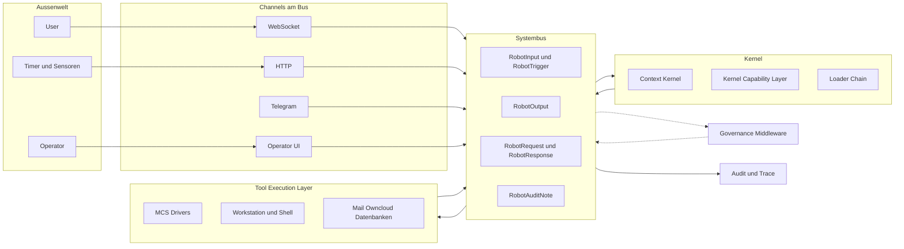

# Robot OS — Zielarchitektur

> Status: kanonisches Zielmodell. Der bisherige Code unter `_reference/` ist als
> Referenz erhalten und wird nicht mehr fortgeschrieben. `src/` enthaelt die
> schrittweise neu aufgebaute Implementierung dieses Zielmodells.

Cephix wird als bus-zentrische, prompt-programmierbare Robot-Plattform neu
aufgebaut. Karpathys LLM-OS-Idee und Software 3.0 liefern den Programmierbegriff:
Firmware, SOPs, Skills, Toolbeschreibungen und Memory sind nicht Beiwerk, sondern
die Software, die in einen handlungsfaehigen Kontext geladen wird. ROS und PC
liefern die Strukturanalogie: ein Systembus als tragendes Organ, an dem
Kernel, IO-Kanaele, Tool Execution, Loader, Governance und Audit als
Teilnehmer haengen.

## Leitidee

Der Systembus ist nicht eine Komponente neben anderen, sondern das tragende
Organ. Alles, was der Roboter wahrnimmt, entscheidet, ausfuehrt oder
protokolliert, ist eine Nachricht auf diesem Bus. Komponenten existieren als
Teilnehmer am Bus, nicht als zueinander verdrahtete Dienste. Was nicht auf
dem Bus stattfindet, existiert in der Architektur nicht.

Damit verschwinden die heutigen Doppelstrukturen aus `SemanticBus`,
`RuntimeEventLoop.queue` und `Telemetry`. Es gibt einen Bus, einen Vertrag,
viele Teilnehmer.

Eine Roboterinstanz ist genau ein Bus. Multi-Roboter ist Federation ueber
mehrere Busse, nicht ein gemeinsamer Bus.

## Topologie



Lese-Reihenfolge: alle Pfeile gegen den Bus. Governance sitzt als
Pre-Delivery-Middleware in den Bus, nicht daneben. Audit haengt als
Subscriber dran.

## Bus-Semantik

Der Bus ist eine routende Queue-Infrastruktur, nicht ein Broadcast-Strom.
Jeder Teilnehmer hat seine eigene Queue, der Bus routet Nachrichten anhand
von Topic, Adressat oder Korrelation in die richtige Queue. Teilnehmer
pullen, wenn sie bereit sind.

Der Bus selbst wird als Port modelliert. Erste Implementierung in-memory mit
`asyncio.Queue`. Der Port deklariert aber bereits die Eigenschaften, die
persistente Bus-Implementierungen mitbringen (gerichtetes Routing, Topics,
Subscribe, Ack, Dead Letter, Korrelation, Priority, Timeout). Der Wechsel
zu einer persistenten Implementierung ist dann ein Adapter-Tausch.

Eigenschaften:

- **Backpressure**: ein langsamer Teilnehmer bremst nur seine eigene Queue.
- **Crash-Resilienz**: Queues koennen persistent sein. Was nicht abgeholt
  wurde, ueberlebt einen Neustart.
- **Reihenfolge**: FIFO pro Queue, bewusst keine globale Ordnung.
- **Priority pro Queue**: Antworten duerfen vor neuen Inputs eingereiht
  werden, damit ein laufender Run nicht hinter neuer Konversation wartet.
- **Timeouts und Dead Letter**: eine `RobotRequest` deklariert ihre maximale
  Antwortzeit; bei Ueberschreitung erzeugt der Bus eine
  Fehler-`RobotResponse`. Nicht zustellbare Nachrichten landen in einer
  Dead-Letter-Queue.

Pub/Sub ist die Ausnahme, nicht die Regel. Broadcast wird gezielt fuer
zwei Genres genutzt:

- **Lifecycle**: `RobotReady` und `RobotShutdown` auf
  `robot.lifecycle`. Mit *retain* gepublished, damit spaete Subscriber
  (auch nachtraeglich angeklemmte Audit-Sinks oder Operator-Tools) den
  letzten Stand sofort als ersten Event in ihre Queue gelegt
  bekommen. Genau einer pro Topic wird gehalten; ein neuer ersetzt
  den alten.
- **Audit**: `RobotAuditNote` als Strom, ohne retain. Sie muss nicht
  abgearbeitet werden, sondern von allen Beobachtern gesehen werden
  koennen.

Routable Queue (`subscribe`) und Broadcast (`subscribe_broadcast`)
leben in getrennten Buckets: ein `publish` erreicht keinen
Broadcast-Subscriber, ein `publish_broadcast` keinen Routable-Subscriber.

Mapping pro Nachrichtentyp:

- `RobotInput` und `RobotTrigger`: Queue, Empfaenger Kernel.
- `RobotRequest`: Queue, gerichtet an genau einen Adressaten (Tool-Driver,
  Loader, Content-Filter).
- `RobotResponse`: Queue, ueber `correlation_id` zurueck an den Sender der
  `RobotRequest`.
- `RobotOutput`: Queue, ueber Adressierung an den passenden Channel.
- `RobotReady`, `RobotShutdown`: Pub/Sub mit retain auf
  `robot.lifecycle`. Eine Quelle (der Robot selbst), beliebig viele
  Subscriber.
- `RobotAuditNote`: Pub/Sub mit mehreren Subscribern (Audit-Sink,
  Operator-UI, Notebooks).

## Bus-Vertrag

Alle Nachrichten sind `RobotEvent`. Subtypen druecken Rolle und
Erwartungshaltung aus:

- `RobotInput`: konversationale Eingabe von aussen. Beispiel: User schickt
  Text auf einem Channel.
- `RobotTrigger`: autonome Anregung von aussen ohne Konversationsabsicht.
  Beispiel: Timer, Sensor, geplanter Job. Kann auch als Spezialfall von
  `RobotInput` modelliert werden, behaelt aber semantischen Eigenwert fuer
  Routing und Audit.
- `RobotOutput`: Nachricht an die Aussenwelt, fire-and-forget. Beispiel:
  Antworttext an User, Mailversand-Bestaetigung an Channel.
- `RobotRequest`: gerichtete Anfrage zwischen Bus-Teilnehmern, erwartet
  Antwort. Beispiel: Kernel fragt Tool Execution Layer nach `mail.list`.
  Kernel fragt Channel nach Approval.
- `RobotResponse`: Antwort auf eine `RobotRequest`. Verweist per
  Korrelation auf die ausloesende Anfrage. Kann Erfolg oder Fehler sein,
  Fehler ist explizit modelliert.
- `RobotReady`: Lifecycle-Broadcast nach erfolgreichem Bring-up. Traegt
  Roboter-Identitaet (`robot_id`, `robot_name`), `boot_id` und einen
  Snapshot der gestarteten Komponenten. Wird retained gepublished,
  damit spaeter angeklemmte Komponenten den Boot-Stand kennen.
- `RobotShutdown`: Lifecycle-Broadcast bei Beginn der
  Shutdown-Sequenz. Traegt `grace_seconds` und `reason`. Komponenten,
  die drainen muessen, bekommen so ein Vorwarnsignal vor dem
  eigentlichen `stop()`-Aufruf.
- `RobotAuditNote`: ausschliesslich fuer Audit relevante Nachricht, die
  kein anderer Teilnehmer braucht.

Pflichtfelder pro Nachricht:

- `event_id`: globale Identitaet der Nachricht.
- `correlation_id`: bindet Request und Response zusammen.
- `run_id`: bindet zusammenhaengende Schritte zu einem fachlichen Vorgang.
- `topic`: logische Adresse, ueber die Subscriber gefiltert werden.
- `principal`: wer im Namen wessen handelt.
- `timestamp` und `source`.

## Lebenszyklus und Bootsequenz

Konstruktor und Bootsequenz sind getrennt. `Robot(...)` macht keine
Arbeit, sondern stellt nur die Bauteile zusammen — Bus, Kernel,
Channels werden in Felder gelegt, niemand subscribet, kein Socket geht
auf, keine Task laeuft. Vergleich: zusammengeschraubte Hardware bei
abgeschaltetem Strom.

Die Bootsequenz lebt komplett in `Robot.start()`:

```
Robot.start()
  ├─ bus.start()             POST: Bus-Backplane testet sich, FIFO-Queues bereit
  ├─ RobotReady (retain)     BIOS-Beep: Identitaet und Component-Inventar auf den Bus
  ├─ kernel.start(bus)       Kernel klemmt sich an, kann robot.lifecycle lesen
  ├─ channels[*].start(bus)  Channels klemmen sich an, lesen retained Identity
  └─ "online" log            Login-Prompt, ab hier reines Idle
```

Dass `RobotReady` *vor* Kernel und Channels publisht wird, ist das
wesentliche Detail. Es wird als retained Broadcast auf
`robot.lifecycle` gepublished; jede spaetere Subscription bekommt den
letzten Stand sofort als ersten Event in ihre Queue. Damit gibt es
keine Race: ein Channel weiss beim ersten Welcome-Frame schon, mit
welchem Roboter ein Client redet.

Nach `online` ist kein Bauteil mehr "in charge". Das System ist rein
event-driven:

- der Kernel schlaeft auf seiner Input-Topic, wacht auf wenn ein
  `RobotInput` kommt;
- Channels schlafen parallel auf ihrem Listen-Socket und ihrem
  Output-Topic;
- der Robot selbst wartet in `run_forever()` nur noch auf das
  Stop-Event.

Es gibt also keinen "Kernel uebernimmt"-Moment. Wer in der
PC-Analogie nach dem Master sucht, findet ihn beim Bus, nicht beim
Kernel. Der Cephix-Kernel ist Kontext-Kurator und Actor-Vermittler,
kein OS-Kernel.

Der Shutdown spiegelt die Bootsequenz:

```
Robot.stop()
  ├─ RobotShutdown (retain)  SIGTERM-Broadcast: Komponenten duerfen drainen
  ├─ sleep(shutdown_grace)   Drain-Phase, default 5s
  └─ teardown                SIGKILL: Components in Reverse-Order, Bus zuletzt
```

Komponenten, die auf den Shutdown-Broadcast subscriben, koennen
waehrend der Grace-Phase Cleanup machen. Beispiel: der
WebsocketChannel schickt ein `{"type": "shutdown", ...}`-Frame an
offene Sessions, damit Clients ihre Verbindung sauber schliessen.
Auch bei `shutdown_grace = 0` wird mindestens einmal ge-yieldet,
damit Broadcast-Subscriber den Shutdown-Event sehen, bevor ihre
Consumer-Tasks im Teardown gecancelt werden.

Zuordnung zur PC-Analogie:

| PC-Architektur | Cephix |
|---|---|
| OS-Kernel (zentrale Vermittlung) | Bus |
| Userspace-Daemon (reagiert auf Events) | Kernel im Cephix-Sinn |
| Treiber / IO | Channels |
| ACPI-/EFI-Tabelle | retained `RobotReady` auf `robot.lifecycle` |
| SIGTERM | `RobotShutdown` |
| SIGKILL | `Robot._teardown()` nach Grace |

Konsequenzen fuer das Komponenten-Design:

- Eine Komponente, die ihre Roboter-Identitaet braucht, liest sie
  ueber den Bus. Sie subscribet `robot.lifecycle` als Broadcast und
  liest synchron `bus.retained(...)` im eigenen `start(bus)` ab,
  damit ihre erste Reaktion (z.B. der Welcome-Frame eines Channels)
  bereits korrekt befuellt ist. Setter wie `set_robot_identity` sind
  nicht vorgesehen — die einzige Wahrheit fliesst ueber den Bus.
- Eine Komponente, die fuer einen sauberen Shutdown Vorbereitungszeit
  braucht, subscribet ebenfalls `robot.lifecycle` und reagiert auf
  `RobotShutdown`, anstatt erst in ihrem eigenen `stop()`
  Cleanup-Logik einzubauen.
- Audit-Sinks und Observer-Tools, die nach dem Boot anlanden, lernen
  durch das retained `RobotReady` automatisch, mit welcher
  Roboterinstanz sie es zu tun haben.

## Teilnehmer am Bus

### Channels

IO-Kanaele zur Aussenwelt. Sind nicht mehr eigene Architekturlayer, sondern
Bus-Teilnehmer mit zwei Pflichten:

- `RobotInput` und `RobotTrigger` aus der Aussenwelt einspeisen.
- `RobotOutput` an die richtige Aussenwelt-Adresse zustellen.

Operator-UI ist konsequent auch nur ein Channel.

### Context Kernel

Ein Bus-Teilnehmer mit besonderen Privilegien. Er sieht alle relevanten
Topics, darf den Kernel Capability Layer ansprechen und entscheidet,
welcher Actor den naechsten Schritt macht. Der Kernel ruft keine
Komponente direkt auf; er publiziert `RobotRequest` und konsumiert
`RobotResponse`.

Der Kernel selbst ist Actor-neutral. Er traegt keine LLM-Logik. Seine
Aufgabe ist, ein passendes Context Image zu erzeugen und es als
`RobotRequest` an einen Actor-Topic zu schicken.

### Actors: LLM, Programm, Mensch

Drei austauschbare Bus-Teilnehmer, die alle auf demselben Actor-Topic eine
`RobotRequest` "entscheide den naechsten Schritt" konsumieren und mit
einer `RobotResponse` antworten:

- `LLM Actor`: Driver gegen Anthropic, OpenAI oder lokales Modell. Bekommt
  das Context Image als Prompt und antwortet mit Plan, Tool-Intent oder
  Text.
- `Program Actor`: deterministischer Driver. Bekommt das Context Image als
  strukturierte Daten und fuehrt Code aus. Geeignet fuer eingelaeufige
  SOP-Schritte oder Reflexe.
- `Human Actor`: Operator-UI als Driver. Bekommt das Context Image als
  verstaendliche Sicht und der Mensch entscheidet manuell.

Wechsel mitten im Run ist moeglich, weil der Kernel pro `RobotRequest`
neu adressiert. Ein Mensch kann ein Run-Stueck uebernehmen, ohne dass der
Kernel oder der Bus angepasst werden muessen.

### Kernel Capability Layer

Die internen Funktionen, die der Roboter braucht, um seinen eigenen
Zustand zu fuehren. Memory schreiben, Notebook anlegen, SOP aktivieren,
Skill laden, Context komprimieren, Approval-Regel speichern. Diese
Funktionen sind nicht Tools im Sinne eines LLM-Werkzeugs. Sie sind
Infrastruktur und werden ueber eigene Topics auf dem Bus angesprochen.

### Tool Execution Layer (MCS)

Alles, was die Welt veraendert oder Daten aus der Welt holt. Hier passt
[MCS](https://modelcontextstandard.io/) als Driver-Standard, weil ein
Driver API und Secrets kapselt und der Kernel keinen Zugriff auf
Credentials hat. Tools werden ueber `RobotRequest` mit definiertem
Tool-Namen angefordert; das Ergebnis kommt als `RobotResponse`.

Die Trennung ist hart: was die Welt aendert, geht ueber den Tool
Execution Layer; was den Roboter aendert, geht ueber den Kernel
Capability Layer. Damit fallen die heutigen `system_tool`-Krucken weg.

### Loader Chain

Tool Registry, Skill Loader und SOP Loader stehen als Bus-Teilnehmer in
einer klaren Hierarchie:

```
Tool Registry  <-  Skill Loader  <-  SOP Loader
```

Regeln:

- Skill Loader prueft Skill-Definitionen gegen die Tool Registry, niemals
  direkt gegen Driver.
- SOP Loader prueft SOP-Definitionen gegen Skill Loader und Tool Registry.
- Skills duerfen weitere Skills referenzieren. SOPs duerfen weitere SOPs
  referenzieren. Loader erkennen Zyklen beim Laden und brechen ab.
- Versionsbindung beim Laden: ein SOP-Run lockt die genauen Skill- und
  Tool-Versionen ein, mit denen er startet. Ein spaeteres Update aendert
  keinen laufenden Run.
- Aufloesung ist eager und gecached: alle Abhaengigkeiten werden vor
  Run-Start bestaetigt, sonst startet der Run nicht.

### Governance

Hybrid aus Middleware und Teilnehmer.

Harte Pre-Delivery-Pruefung als Bus-Middleware:

- `RobotRequest` an Tool Execution: Risk-Klasse, Approval-Regel,
  SOP-`safe_actions`, Topic-ACL.
- `RobotOutput` an Channel: Topic-ACL, Adressat-Vertrauensstufe.
- `RobotInput` an Kernel: Channel-Vertrauensstufe, Ratelimit.

Eine Middleware-Pruefung kann zustellen, abweisen, oder durch eine
`RobotRequest` an den User fuer Approval umgelenkt werden. Sie ist
deterministisch und fuer den Publisher unsichtbar.

Inhaltliche Pruefung als expliziter Bus-Teilnehmer:

- PII-Detektion auf `RobotOutput`.
- Promptinjection-Scan auf `RobotInput`.
- Output-Filter auf `RobotOutput`.

Inhaltliche Pruefer werden per `RobotRequest` aufgerufen und antworten mit
`RobotResponse`. Sie duerfen modellbasiert oder langsam sein, ohne den
Hot Path zu blockieren.

### Audit

Audit ist ein privilegierter Subscriber. Es schreibt nicht zurueck und
blockiert nicht. Komponenten-interne Vorgaenge, die kein anderer
Teilnehmer braucht, werden zu `RobotAuditNote` auf dem Bus, nicht zu
Direktaufrufen an Audit. Damit gibt es genau eine Stelle, an der die Welt
protokolliert wird.

## Selbstlernen entlang der Wissensschichten

- `User Memory`: personenbezogen, jederzeit loeschbar.
- `Robot Memory`: stabile, nicht personenbezogene Erfahrung.
- `Tool Notebooks`, `Skill Notebooks`, `SOP Notebooks`: Erfahrungsschicht
  pro Artefakt.
- Skills und SOPs koennen aufeinander aufbauen, Notebooks reichern sie an.

Ein Loeschen von User Memory beruehrt Tool-, Skill- und SOP-Notebooks
nicht. Damit bleibt der Roboter klueger, ohne Persoenliches zu speichern.

Lernen findet als gewoehnliche Bus-Konversation statt: Ein Run schreibt
am Ende eine `RobotRequest` an den Kernel Capability Layer, ein neues
Notebook-Item zu speichern. Audit sieht das automatisch, weil es auf dem
Bus liegt.

## Architekturentscheidungen

| Thema | Entscheidung |
|---|---|
| Bus-Topologie | In-Process Bus pro Roboterinstanz. Tool Execution Layer darf Driver in eigenen Prozessen oder ueber Netzwerk anbinden. |
| Persistenz | Erste Implementierung in-memory; der Bus ist als Port mit den Eigenschaften persistenter Queue-Bibliotheken modelliert (Adapter-Tausch ohne Architekturschnitt). Prio fuer fruehe Persistenz haben Audit und ausstehende Approvals. |
| Bus-Semantik | Routende Queues, FIFO pro Teilnehmer, Priority erlaubt, Timeouts und Dead Letter. Pub/Sub fuer Lifecycle (`RobotReady`, `RobotShutdown` mit retain) und Audit (`RobotAuditNote` ohne retain). Routable und Broadcast leben in getrennten Buckets. |
| Bootstrap | `Robot.start()` ist die Bootsequenz: `bus.start`, dann retained `RobotReady` auf `robot.lifecycle` (BIOS-POST), dann Kernel und Channels attachen. Identitaet, Komponenten-Inventar und Boot-ID fliessen ueber den Bus, nicht ueber Setter. Shutdown spiegelbildlich mit retained `RobotShutdown` plus Grace-Phase vor dem Teardown (SIGTERM-/SIGKILL-Pattern). |
| Topic-ACLs | Teil des Bus-Vertrags. Beim Subscribe deklariert ein Teilnehmer die gewuenschten Topics; der Bus prueft die Berechtigung. |
| Governance-Platzierung | Hybrid. Harte Policy als Bus-Middleware, inhaltliche Filter als expliziter Teilnehmer per `RobotRequest`/`RobotResponse`. |
| Run-Identitaet | Flache `run_id` pro Vorgang. Optionale `parent_run_id` fuer SOP-in-SOP, Skill-in-Skill und Approval-Continuation wird in der Implementierung entschieden, nicht jetzt im Bus-Vertrag fixiert. |
| Fehler-Modellierung | `RobotResponse` traegt Erfolg- oder Fehler-Variante. Katastrophale Vorfaelle erzeugen zusaetzlich eine `RobotAuditNote`. |
| Versionsbindung | Beim Start eines SOP-Runs werden alle benoetigten Skills und Tools mit Version eingefroren. Hotfixes betreffen nur neue Runs. |
| MCS-Reichweite | MCS ist Driver-Standard im Tool Execution Layer. MCS-Toolbeschreibungen koennen zusaetzlich als Quelle fuer Tool-Schemas im Context Image dienen. SOPs und Skills bleiben eigenes Format. |
| Actor-Modell | Ein Kernel, drei austauschbare Actors (LLM, Programm, Mensch) auf einem Actor-Topic. Modus-Wechsel pro `RobotRequest` moeglich. |
| Kernel Capabilities vs. Tools | Was die Welt aendert, geht ueber Tool Execution Layer. Was den Roboter aendert, geht ueber Kernel Capability Layer. |

Bewusst noch nicht entschieden:

- **Timeouts und Dead Letter** im Detail (Default-Owner, DLQ-Konsument).
- **Priority-Schema**: feste Klassen oder pro Queue konfigurierbar.
- **Federation**: wie mehrere Roboter ueber Bus-Federation kooperieren
  (mehrere Roboterinstanzen = mehrere Busse, die Bruecke ist offen).
- **Firmware-Bootstrap**: wie SOPs, Skills und Memory beim Start in
  den Roboter geladen werden. Die `RobotReady`-Sequenz traegt das
  Komponenten-Inventar; der Inhalt der Loader-Kette ist davon noch
  nicht beruehrt.

## Verhaeltnis zum Ist-Code unter `_reference/`

Bewusst nachgelagert. Der `_reference/`-Ordner enthaelt den vorherigen
Implementierungsstand und dient als Vergleichsbasis. Beim schrittweisen
Wiederaufbau in `src/` werden ausgewaehlte Konzepte uebernommen:

- `SemanticBus`, `RuntimeEventLoop.queue` und `Telemetry` werden auf den
  einen Systembus konsolidiert.
- `RobotEvent` bleibt als Basistyp; die Subtypen werden eingefuehrt.
- `system_tool`-Marker entfaellt durch die Trennung Tool Execution Layer
  und Kernel Capability Layer.
- `DefaultSOPResolver` und `SkillResolverPort` werden Teilnehmer der
  Loader-Kette.
- `PolicyToolExecutionGuard` wandert in die Governance-Middleware.

Anders als in der bisherigen Implementierung wird die Architektur nicht
ueber Layer mit injizierten Adaptern gezogen, sondern ueber Bus-Teilnehmer
mit klaren Topic- und Nachrichten-Vertraegen.
